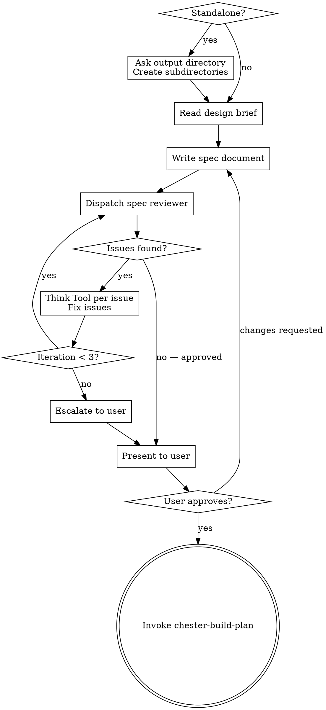

# Build Spec

Formalize an approved design into a durable spec document, validate it through automated and human review.

<HARD-GATE>
Do NOT invoke chester-build-plan or any implementation skill until the spec has passed automated review AND the user has approved it. Only then proceed to invoke chester-build-plan.
</HARD-GATE>

## Entry Condition

A design exists — either:
- A design brief from chester-figure-out at `{output_dir}/design/{sprint-name}-design-00.md`
- A human-written brief or design from an external source
- A design described in conversation context

The output directory and subdirectories should already exist (created by figure-out). If invoked standalone, this skill creates them.

## Checklist

**Task reset (do first, do not track):** Before creating any tasks, call TaskList. If any tasks exist from a previous skill, delete them all via TaskUpdate with status: `deleted`. This is housekeeping — do not create a tracked task for it.

You MUST create a task for each of these items and complete them in order:

1. **Setup** — if invoked standalone (no figure-out), ask for output directory and create subdirectories; derive three-word sprint name from directory name or ask explicitly
2. **Read design brief** — read the design brief from disk or gather design from conversation context
3. **Write spec document** — synthesize design into structured spec, write to `{output_dir}/spec/{sprint-name}-spec-00.md`, print full content to terminal
4. **Automated spec review loop** — dispatch spec-document-reviewer subagent, Think Tool gate per issue, fix and re-dispatch (max 3 iterations, then escalate to user)
5. **User review gate** — present clean spec to user for review; if changes requested, apply and loop back to step 4
6. **Commit spec** — commit the approved spec with message `checkpoint: spec approved`
7. **Transition** — invoke chester-build-plan

## Announcement

When this skill activates, announce: "I'm using the chester-build-spec skill to write the formal spec."

## Process Flow



**The terminal state is invoking chester-build-plan.** Do NOT invoke any other implementation skill.

## Standalone Invocation

When invoked without a prior chester-figure-out session:

1. Ask for the output directory (same three options as figure-out: docs/chester default, sprint directory, custom path)
2. Create the root directory with four subdirectories: `design/`, `spec/`, `plan/`, `summary/`
3. Derive the three-word sprint name from the directory name (e.g., `navigation-tree-refactor` from `2026-03-25-navigation-tree-refactor/`). If the directory name does not follow the convention, ask for the sprint name explicitly.

## Writing the Spec

- Read the design brief from disk (if it exists) and conversation context
- Synthesize into a structured spec document covering: architecture, components, data flow, error handling, testing strategy, constraints, non-goals
- Scale each section to its complexity — a few sentences if straightforward, detailed if nuanced
- When the output directory was chosen as option B (sprint directory) or C (custom path), include YAML frontmatter in the spec document with `output_dir` and `sprint_prefix` so downstream skills (chester-build-plan, chester-write-code, chester-write-summary, chester-trace-reasoning) can inherit the output path:

```yaml
---
output_dir: Documents/Refactor/Sprint 032 Core Validation
sprint_prefix: Sprint032
---
```

When option A (default docs/chester/) was chosen, no frontmatter is added.

- Write to `{output_dir}/spec/{sprint-name}-spec-00.md`
- Print the full document content to the terminal so the user can read it without opening the file

## Automated Spec Review Loop

After writing the spec:

1. Dispatch spec-document-reviewer subagent (see spec-reviewer.md in this skill directory)
2. The reviewer checks: completeness, consistency, clarity, scope, YAGNI

**Think Tool gate (per issue):** When the spec reviewer returns issues, invoke `mcp__think__think` for each issue before applying a fix:
  "Is this issue valid given the spec's stated intent? What is the minimal fix?
   Does this fix affect any adjacent section of the spec?"

Apply the fix, then move to the next issue. Re-dispatch the reviewer after all issues from the current round are addressed.

**Fallback:** If `mcp__think__think` is unavailable, proceed without the gate and note the skip to the user.

3. If loop exceeds 3 iterations, escalate to user for guidance
4. On subsequent iterations, write revised spec as `{sprint-name}-spec-01.md`, `02`, etc.

## User Review Gate

After the automated review loop passes:

> "Spec written and reviewed at `{path}`. Please review and let me know if you want changes before we proceed to the implementation plan."

Wait for the user's response. If they request changes, apply them and re-run the automated review loop. Only proceed once the user approves.

## Commit Approved Spec

After the user approves the spec:

```bash
git add {output_dir}/spec/{sprint-name}-spec-*.md
git commit -m "checkpoint: spec approved"
```

This checkpoint marks the transition from specification to planning.

## MCP Usage

- **Think** only — per issue evaluation during the review loop
- Sequential and Structured thinking are not used; spec writing is craft, and the review loop volume does not warrant structured cross-referencing

## File Naming

Files follow the convention: `{sprint-name}-{artifact}-{nn}.md`
- `{sprint-name}` is the three-word hyphenated name (e.g., `figure-out-decomposition`)
- `{artifact}` is `spec`
- `{nn}` is `00` for the original, `01`, `02` for subsequent versions

## Integration

- Invoked by: chester-figure-out (primary), or user directly (standalone)
- Transitions to: chester-build-plan
- Does NOT invoke: chester-attack-plan, chester-smell-code, or any implementation skill
