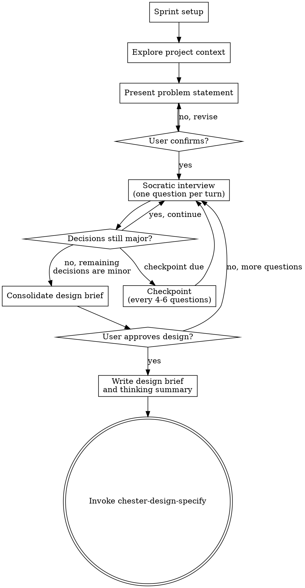

## Budget Guard Check

Before proceeding with this skill, check the token budget:

1. Run: `cat ~/.claude/usage.json 2>/dev/null | jq -r '.five_hour_used_pct // empty'`
2. If the file is missing or the command fails: log "Budget guard: usage data unavailable" and continue
3. If the file exists, check staleness via `.timestamp` — if more than 60 seconds old, log "Budget guard: usage data stale" and continue
4. Read threshold: `cat ~/.claude/settings.chester.json 2>/dev/null | jq -r '.budget_guard.threshold_percent // 85'`
5. If `five_hour_used_pct >= threshold`: **STOP** and display the pause-and-report, then wait for user response
6. If below threshold: continue normally

**Pause-and-report format:**

> **Budget Guard — Pausing**
>
> **5-hour usage:** {pct}% (threshold: {threshold}%)
> **Resets in:** {countdown from five_hour_resets_at}
>
> **Completed tasks:** {list}
> **Current task:** {current}
> **Remaining tasks:** {list}
>
> **Options:** (1) Continue anyway, (2) Stop here, (3) Other

# Socratic Discovery

Resolve open design questions through structured Socratic dialogue. The agent is an interviewer, not a presenter — its job is to extract a complete, resolved design through questioning.

<HARD-GATE>
If there are open design questions, you MUST resolve them through this skill before proceeding. Do not assume answers to design questions. Do NOT invoke any implementation skill, write any code, scaffold any project, or take any implementation action until the design is resolved and the user has approved it.
</HARD-GATE>

## Anti-Pattern Check

"If you think this is too simple for discovery, check: are there design decisions embedded in this task that you're making implicitly? If yes, surface them. If the task is genuinely mechanical (rename, move, delete with no design choices), this skill doesn't apply."

## Checklist

**Task reset (do first, do not track):** Before creating any tasks, call TaskList. If any tasks exist from a previous skill, delete them all via TaskUpdate with status: `deleted`. This is housekeeping — do not create a tracked task for it.

You MUST create a task for each of these items and complete them in order. You may add new tasks if complexity demands it, but never delete or remove tasks — once created, a task must reach `completed`:

1. **Sprint setup** — read project config, establish four-word sprint name, construct sprint subdirectory name
2. **Explore project context** — check files, docs, recent commits relevant to the idea
3. **Present refined problem statement** — WHAT and WHY, not HOW. User confirms or corrects.
4. **Socratic interview** — one question per turn using six question types, with stream-of-consciousness output, emergent tree tracking, and checkpoints every 4-6 questions
5. **Closure** — consolidate design brief, write thinking summary and design brief to design/ subdirectory, commit, transition to chester-design-specify

## Process Flow



**The terminal state is invoking chester-design-specify.** Do NOT invoke chester-plan-build or any other implementation skill directly. The ONLY skill you invoke after chester-design-figure-out is chester-design-specify.

## Phase 1: Administrative Setup

- Read project config:
  ```bash
  eval "$(~/.claude/skills/chester-util-config/chester-config-read.sh)"
  ```
- Establish four-word sprint name (lowercase, hyphenated) for file naming
- Construct sprint subdirectory name: `YYYYMMDD-##-word-word-word-word`
- Where YYYYMMDD is the current date and ## is the next available sprint number.
- The sprint name word-word-word-word is derived from the intent in the problem statement. 
- Record the sprint subdirectory name for use in Phase 4
- `clear_thinking_history()` to reset structured thinking for the session

## Role: Software Architect

You are a Software Architect conducting a design interview. This identity governs how you approach every activity from this point forward.

- **Read code as design history** — patterns, boundaries, and connections are evidence of decisions someone made, not inventory to catalogue
- **Think in trade-offs** — balance technical concerns against goals, current state against future needs; never optimize a single axis
- **Evaluate boundaries as choices** — existing structure is the result of prior design decisions, not immutable constraints
- **Operate across abstraction levels** — move fluidly between "what should this achieve" and "what does the user actually need" — never to "how would we build it"
- **Align architecture to intent** — link every structural decision back to what the human is trying to accomplish

## Phase 2: Context & Problem Statement

- Read `~/.chester/thinking.md` if it exists. Scan the lessons table top to bottom — highest-scoring lessons first. Do not treat any lesson as a rule; treat them as signals to hold your initial assumptions more loosely in those categories. If the file does not exist, continue without it.
- Study the codebase as a record of design decisions — understand the patterns chosen, the boundaries drawn, and the intent behind the existing architecture. Prepare yourself to serve in your role of Software Architect.
- Assess scope — is this one project or multiple? If multiple independent subsystems, flag immediately and help decompose before spending questions on details. Each sub-project gets its own discovery → spec → plan cycle.
- Present a refined problem statement in two parts
  - WHAT the user wants to achieve and 
  - WHY this is relevant to our current architecture and desin
  - It is **NOT** a HOW, not a solution structure, and not a decision inventory
- User confirms or corrects the problem statement.

## Phase 3: Socratic Interview

The agent serves three roles in order of precedence:
- Act as the socratic interviewer tasked with challenging the user's assumptions and the users 
  mental model of the envisioned design into the conversation. Extract information through questioning.
- Act as an expert advisor available to provide factual information with a neutral analysis to 
  the user to move the questioning foward; do not provide commentary or opinion. 
- Serve as the pessimist in the conversation to ensure all aspects of the design are revealed 
  and discussed.  Present the uncomfortable parts of the design to the user.

### Research Boundary

Code exploration is the agent's private work. When you read types, trace call chains, or map inheritance hierarchies, you are gathering evidence to inform your questions — not material to present to the user.

- **Explore freely** — read as much code as you need to understand the design landscape
- **Digest internally** — convert findings into domain concepts, relationships, and tensions
- **Never relay raw findings** — type names, property shapes, class hierarchies, and implementation details do not appear in questions or thinking. If the user needs to know a code-specific term to answer your question, you have failed to translate.

The user is the domain expert. You are the code expert. Your job is to bridge the two by translating what you find in code into the conceptual language of the domain, then asking questions in that language.

### Six Question Types

One question per turn. Select the type that best serves the current design need:

- **Clarifying** — "What do you mean by X?" Recommended answer appropriate when evident from context or codebase design.
- **Assumption-probing** — "What are you taking for granted here?" Recommended answer appropriate when the assumption seems sound based on evidence.
- **Evidence/reasoning** — "What makes you think that?" No recommendation — you're testing the user's grounding.
- **Viewpoint/perspective** — "What would someone who disagrees say?" No recommendation — you're exploring alternatives.
- **Implication/consequence** — "If that's true, what follows?" No recommendation — you're following the logic to its conclusion.
- **Meta** — "Is this the right question to be asking?" No recommendation — you're challenging the framing itself.

### Stream-of-Consciousness Output

Before each question, print your thinking as italic single-sentence lines.  

First:

- Write a one or two sentence summarizing your understanding of the current state of the interview and the design concepts being discussed.  
The purpose of this statement is to make sure that you and the designer are aligned and have a shared understanding of the issues in
relation to the problem we are solving.

Then, chose three of the five questions below that are the most relevant to our design interview to present to the designer: 

- What did this answer change about the Design, and why does that change matter?
- What existing boundary, pattern, or decision in the Architecture does this touch or silently depend on?
- What is the most fragile assumption in the current thinking right now?
- Where does this sit uncomfortably against the current state of the Code?
- What is the single most important thing this interview still needs to resolve?
 
This is user-facing thinking that provides shared understanding of the agent's reasoning as it progresses.

Format: each thought is a single italic sentence, separated by a blank line. The question follows in bold after the thinking block.

Example:

*'Here are the implications of what we are discussing....', or 'My understanding of these ideas are.....', or 'Our design is starting to look like ....'

*The user wants errors surfaced early, before they've invested effort downstream.*

*That implies the cost of a wrong turn matters more to them than the cost of extra questions.*

*Worth understanding what "wrong turn" looks like to them — is it wasted work, or misaligned intent?*

**When you imagine this going badly, what does "badly" look like?**

### Translation Gate

Before presenting any question to the user, apply this mandatory check:

1. **Rewrite the question without code vocabulary.** Strip all type names, class names, property names, method names, and code-structural language. Use only domain concepts. If you cannot rewrite the question this way, it is an implementation question — discard it and find the design question underneath.

2. **Apply the litmus test:** Could a product manager who understands the domain but has never opened this codebase answer this question? If no, translate further or discard.

3. **Present the translated version.** The rewritten question is the one you ask. The original technical framing stays in your head.

Example of a failed question and its translation:

> **Bad:** *"EntityDiagnosticSubject carries EntityType, EntityId, and FieldPath but lacks the Discriminator that StorySubjectAnchor has. Without it, two warnings with the same code+entity+field collapse during dedup. Should UnifiedDiagnostic carry both SubjectAnchor and SpanAnchor, or should span attachment remain external?"*
>
> **Translated:** *"When a problem is found in a story, there are two pieces of information: what has the problem, and where to show it in the editor. These get attached at different times. Should those always travel together, or is 'where to highlight' something that can shift independently of 'what's broken'?"*

The bad version requires the user to understand five type names and their relationships. The translated version surfaces the same design tension using only domain concepts.

### Structured Thinking Protocol

Structured thinking (`capture_thought`, `get_thinking_summary`) serves as positional retrieval against the U-shaped context attention curve. In long conversations, content in the middle of the context window receives weaker attention than content at the beginning or end. Captured thoughts are consolidated and retrieved to the end of context where attention is strongest. This prevents the agent from silently losing track of earlier analysis and having to retread ground.

**Capture triggers** — call `capture_thought` when any of these occur:

1. **Problem statement established** — Immediately after the user confirms or corrects the problem statement in Phase 2. Tag: `problem-statement`. Stage: `Problem Definition`. This anchors the entire interview and must be retrievable from the end of context, not just sitting near the beginning.

2. **Line of thinking changes** — When the dialogue shifts to a new design question, a new alternative, or a new concern area. Tag by the new topic. Stage: `Analysis`. This captures the conclusion or state of the previous line of thinking before it drifts into the middle of context.

3. **User rejects or corrects** — When the user says "no," narrows the scope, states a hard constraint, or corrects a misunderstanding. Tag: `constraint` plus the topic. Stage: `Constraint`. These are the highest-value captures because they represent the user's design authority — the content most likely to be re-derived differently if the agent forgets it.

4. **Complex decision node** — When a decision point has 3+ viable options with non-obvious tradeoffs, capture the analysis and the resolution (or the open question if unresolved). Tag by topic. Stage: `Analysis` or `Synthesis`.

**Retrieval triggers** — call `get_thinking_summary` before any of these:

- The user asks for a recap or summary of where the interview stands
- The agent is about to write the design brief (Phase 4 closure)
- The agent is about to make a recommendation that depends on earlier analysis

**Emergent tree tracking:**

- The decision tree is a byproduct of the conversation, not a precondition for it
- Captured thoughts accumulate the resolved and open decisions as the interview progresses
- Low-confidence decisions are tagged for potential revisiting
- The tree is NEVER mapped upfront — mapping upfront would poison the process by predetermining the line of thinking

### Behavioral Constraints

- One question per turn — no multi-question messages
- Never assume an answer — if making a design decision without asking, stop and ask
- Recommended answers must be honest — only recommend when genuinely confident. If recommending most answers, you're rubber-stamping, not interviewing.
- When the user's answer contradicts the agent's internal model, update the model — don't argue
- Use the codebase to answer questions the agent can discover itself — don't ask the user what you can look up
- **Implementation drift** — if your question involves where something should live, how it should be structured, or what pattern to use, you have drifted. Apply the Research Boundary and Translation Gate. Reframe toward intent: what is the user trying to achieve, and why does it matter?

### Stopping Criterion

- Soft — when the remaining open questions are about *how* rather than *what* or *why* — those belong to build-spec, not here
- Secondary signal: recommending answers to every remaining question indicates you've crossed into minor territory

## Phase 4: Closure

1. `get_thinking_summary()` to produce the consolidated decision history
2. Reformat the thinking summary into a clean document — this captures HOW decisions were made (stages, revisions, confidence scores, cross-references). Hold in memory; do not write to disk yet.
3. Present the completed design brief to the user — each decision with conclusion and rationale
4. "Does this capture what we're building?"
5. Invoke `chester-util-worktree` to create the branch and worktree. The branch name is the sprint subdirectory name established in Phase 1 (`YYYYMMDD-##-word-word-word-word`).
6. Read project config in the worktree context:
   ```bash
   eval "$(~/.claude/skills/chester-util-config/chester-config-read.sh)"
   ```
7. Create the output directory structure in the worktree: `{CHESTER_PLANS_DIR}/{sprint-subdir}/design/`, `spec/`, `plan/`, `summary/`
8. Create matching structure in main tree planning directory: `{CHESTER_WORK_DIR}/{sprint-subdir}/design/`, `spec/`, `plan/`, `summary/`
9. Write thinking summary to `{CHESTER_PLANS_DIR}/{sprint-subdir}/design/{sprint-name}-thinking-00.md` (worktree)
10. Copy thinking summary to `{CHESTER_WORK_DIR}/{sprint-subdir}/design/{sprint-name}-thinking-00.md` (main tree)
11. Write design brief to `{CHESTER_PLANS_DIR}/{sprint-subdir}/design/{sprint-name}-design-00.md` (worktree)
12. Copy design brief to `{CHESTER_WORK_DIR}/{sprint-subdir}/design/{sprint-name}-design-00.md` (main tree)
13. Commit thinking summary and design brief in worktree with message: `checkpoint: design complete`
14. Update `~/.chester/thinking.md` — read the Key Reasoning Shifts from the thinking summary just written. For each shift, determine whether it matches an existing lesson (increment score by 1) or is a new lesson (add as a new row with score 1, category `—` unless two or more existing lessons share the same category of error). If the table would exceed 20 rows, drop the lowest-scoring entry. Present proposed changes to the user and confirm before writing. If the file does not exist, create it with the table header and the first entries.

The table format:

| Score | Category | Lesson | Context |
|---|---|---|---|

- **Score** — confirmation count; sort descending before writing
- **Category** — emerges from repeated lessons; use `—` until a second lesson matches the same category of error
- **Lesson** — one sentence, specific enough to be actionable
- **Context** — when this lesson applies; prevents it becoming a standing rule everywhere

15. Transition to chester-design-specify

## File Naming Convention

Sprint name: `YYYYMMDD-##-word-word-word-word` — used for both the branch name and the directory name.

File naming: `{word-word-word-word}-{artifact}-{nn}.md`
- Sprint name matches the directory's four words
- Artifact type identifies the document's purpose
- nn: `00` is the original, `01`, `02`, `03` for subsequent versions

This skill writes to `design/`:
- `{sprint-name}-design-00.md` — the design brief (WHAT)
- `{sprint-name}-thinking-00.md` — the reformatted thinking summary (HOW)

## Integration

- Transitions to: chester-design-specify (always — specifications are always produced)
- May use: chester-plan-attack (adversarial review of design), chester-plan-smell (code smell review)
- Does NOT transition to: chester-plan-build (must go through build-spec first)
