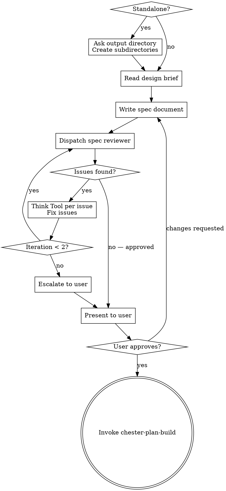

## Budget Guard Check

Before proceeding with this skill, check the token budget:

1. Run: `cat ~/.claude/usage.json 2>/dev/null | jq -r '.five_hour_used_pct // empty'`
2. If the file is missing or the command fails: log "Budget guard: usage data unavailable" and continue
3. If the file exists, check staleness via `.timestamp` — if more than 60 seconds old, log "Budget guard: usage data stale" and continue
4. Read threshold: `cat ~/.claude/settings.chester.json 2>/dev/null | jq -r '.budget_guard.threshold_percent // 85'`
5. If `five_hour_used_pct >= threshold`: **STOP** and display the pause-and-report, then wait for user response
6. If below threshold: continue normally

**Pause-and-report format:**

> **Budget Guard — Pausing**
>
> **5-hour usage:** {pct}% (threshold: {threshold}%)
> **Resets in:** {countdown from five_hour_resets_at}
>
> **Completed tasks:** {list}
> **Current task:** {current}
> **Remaining tasks:** {list}
>
> **Options:** (1) Continue anyway, (2) Stop here, (3) Other

# Build Spec

Formalize an approved design into a durable spec document, validate it through automated and human review.

<HARD-GATE>
Do NOT invoke chester-plan-build or any implementation skill until the spec has passed automated review AND the user has approved it. Only then proceed to invoke chester-plan-build.
</HARD-GATE>

## Entry Condition

A design exists — either:
- A design brief from chester-design-figure-out at `{output_dir}/design/{sprint-name}-design-00.md`
- A human-written brief or design from an external source
- A design described in conversation context

The output directory and subdirectories should already exist (created by figure-out). If invoked standalone, this skill creates them.

## Checklist

**Task reset (do first, do not track):** Before creating any tasks, call TaskList. If any tasks exist from a previous skill, delete them all via TaskUpdate with status: `deleted`. This is housekeeping — do not create a tracked task for it.

You MUST create a task for each of these items and complete them in order:

1. **Setup** — if invoked standalone (no figure-out), ask for output directory and create subdirectories; derive four-word sprint name from directory name or ask explicitly
2. **Read design brief** — read the design brief from disk or gather design from conversation context
3. **Write spec document** — synthesize design into structured spec, write to `{output_dir}/spec/{sprint-name}-spec-00.md`
4. **Automated spec review loop** — dispatch spec-document-reviewer subagent with design brief, Think Tool gate per issue, fix and re-dispatch (max 2 iterations, then escalate to user)
5. **User review gate** — present clean spec to user for review; if changes requested, apply and loop back to step 4
6. **Commit spec** — commit the approved spec with message `checkpoint: spec approved`
7. **Transition** — invoke chester-plan-build

## Process Flow



**The terminal state is invoking chester-plan-build.** Do NOT invoke any other implementation skill.

## Standalone Invocation

When invoked without a prior chester-design-figure-out session:

1. Read project config:
   ```bash
   eval "$(~/.claude/skills/chester-util-config/chester-config-read.sh)"
   ```
2. If `CHESTER_CONFIG_PATH` is `none`, warn: "No Chester config found. Run chester-setup-start first or accept defaults." Use defaults.
3. Ask for the sprint name (four words, hyphenated) if not derivable from context
4. Construct sprint subdirectory: `YYYYMMDD-##-word-word-word-word` (## is the next available sprint number)
5. Create `{CHESTER_PLANS_DIR}/{sprint-subdir}/` with four subdirectories: `design/`, `spec/`, `plan/`, `summary/`

## Writing the Spec

- Read the design brief from disk (if it exists) and conversation context
- Synthesize into a structured spec document covering: architecture, components, data flow, error handling, testing strategy, constraints, non-goals
- Scale each section to its complexity — a few sentences if straightforward, detailed if nuanced
- No YAML frontmatter is needed in spec documents. All skills read output paths from the project config via `chester-config-read.sh`, not from document frontmatter.

- Write to `{output_dir}/spec/{sprint-name}-spec-00.md`

## Automated Spec Review Loop

**Review purpose: Design Alignment** — does the spec faithfully address the design brief's goals, constraints, and decisions?

After writing the spec:

1. Dispatch spec-document-reviewer subagent (see spec-reviewer.md in this skill directory)
   - Provide both the spec path AND the design brief path
   - If no design brief exists (standalone invocation), dispatch with spec only — the reviewer falls back to internal-consistency checking
2. The reviewer checks: goals coverage, constraints respected, no untraceable additions, internal consistency

**think gate (per issue):** When the spec reviewer returns issues, ask this question, think
about the results, and implement the findings:
  "Is this issue valid given the spec's stated intent? What is the minimal fix?
   Does this fix affect any adjacent section of the spec?"

Apply the fix, then move to the next issue. Re-dispatch the reviewer after all issues from the current round are addressed.

3. If loop exceeds 2 iterations, escalate to user for guidance
4. On subsequent iterations, write revised spec as `{sprint-name}-spec-01.md`, `02`, etc.

## User Review Gate

After the automated review loop passes:

> "Spec written and reviewed at `{path}`. Please review and let me know if you want changes before we proceed to the implementation plan."

Wait for the user's response. If they request changes, apply them and re-run the automated review loop. Only proceed once the user approves.

## Commit Approved Spec

After the user approves the spec:

```bash
git add {output_dir}/spec/{sprint-name}-spec-*.md
git commit -m "checkpoint: spec approved"
```

This checkpoint marks the transition from specification to planning.

## MCP Usage

- **Think** only — per issue evaluation during the review loop
- Sequential and Structured thinking are not used; spec writing is craft, and the review loop volume does not warrant structured cross-referencing

## File Naming

Files follow the convention: `{sprint-name}-{artifact}-{nn}.md`
- `{sprint-name}` is the four-word hyphenated name (e.g., `strip-console-report-output`)
- `{artifact}` is `spec`
- `{nn}` is `00` for the original, `01`, `02` for subsequent versions

## Integration

- Invoked by: chester-design-figure-out (primary), or user directly (standalone)
- Transitions to: chester-plan-build
- Does NOT invoke: chester-plan-attack, chester-plan-smell, or any implementation skill
