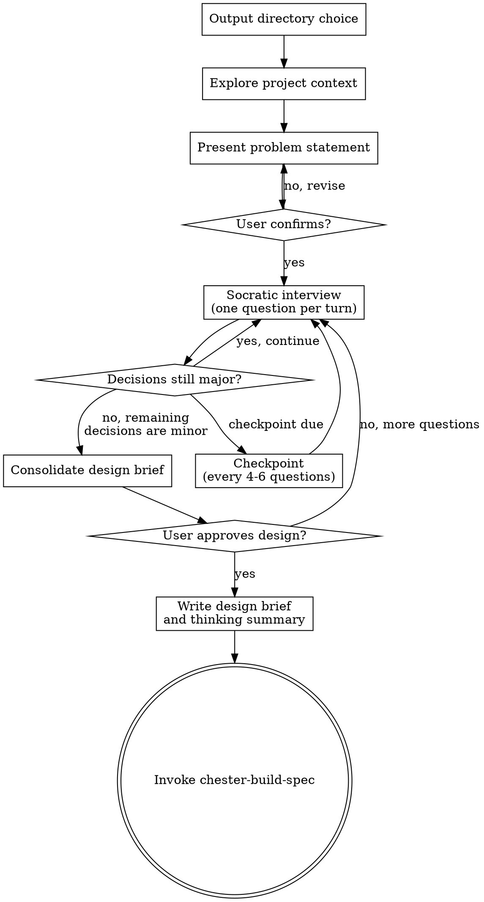

## Budget Guard Check

Before proceeding with this skill, check the token budget:

1. Run: `cat ~/.claude/usage.json 2>/dev/null | jq -r '.five_hour_used_pct // empty'`
2. If the file is missing or the command fails: log "Budget guard: usage data unavailable" and continue
3. If the file exists, check staleness via `.timestamp` — if more than 60 seconds old, log "Budget guard: usage data stale" and continue
4. Read threshold: `cat ~/.claude/chester-config.json 2>/dev/null | jq -r '.budget_guard.threshold_percent // 85'`
5. If `five_hour_used_pct >= threshold`: **STOP** and display the pause-and-report, then wait for user response
6. If below threshold: continue normally

**Pause-and-report format:**

> **Budget Guard — Pausing**
>
> **5-hour usage:** {pct}% (threshold: {threshold}%)
> **Resets in:** {countdown from five_hour_resets_at}
>
> **Completed tasks:** {list}
> **Current task:** {current}
> **Remaining tasks:** {list}
>
> **Options:** (1) Continue anyway, (2) Stop here, (3) Other

## Diagnostic Logging

At skill entry, run: `~/.claude/chester-log-usage.sh before "figure-out" "skill-entry" "{sprint-dir}/summary/token-usage-log.md"`
At skill exit (before transitioning to build-spec), run: `~/.claude/chester-log-usage.sh after "figure-out" "skill-entry" "{sprint-dir}/summary/token-usage-log.md"`

Replace `{sprint-dir}` with the actual sprint directory path. If no sprint directory exists yet, omit the fourth argument (defaults to `~/.claude/chester-usage.log`). The script handles debug flag detection internally — it does nothing if debug mode is not active.

# Socratic Discovery

Resolve open design questions through structured Socratic dialogue. The agent is an interviewer, not a presenter — its job is to extract a complete, resolved design through questioning.

<HARD-GATE>
If there are open design questions, you MUST resolve them through this skill before proceeding. Do not assume answers to design questions. Do NOT invoke any implementation skill, write any code, scaffold any project, or take any implementation action until the design is resolved and the user has approved it.
</HARD-GATE>

## Anti-Pattern Check

"If you think this is too simple for discovery, check: are there design decisions embedded in this task that you're making implicitly? If yes, surface them. If the task is genuinely mechanical (rename, move, delete with no design choices), this skill doesn't apply."

## Checklist

**Task reset (do first, do not track):** Before creating any tasks, call TaskList. If any tasks exist from a previous skill, delete them all via TaskUpdate with status: `deleted`. This is housekeeping — do not create a tracked task for it.

You MUST create a task for each of these items and complete them in order. You may add new tasks if complexity demands it, but never delete or remove tasks — once created, a task must reach `completed`:

1. **Output directory choice** — offer default docs/chester/, sprint directory, or custom path. Create root directory with four subdirectories: design/, spec/, plan/, summary/. Establish three-word sprint name.
2. **Explore project context** — check files, docs, recent commits relevant to the idea
3. **Present refined problem statement** — WHAT and WHY, not HOW. User confirms or corrects.
4. **Socratic interview** — one question per turn using six question types, with stream-of-consciousness output, emergent tree tracking, and checkpoints every 4-6 questions
5. **Closure** — consolidate design brief, write thinking summary and design brief to design/ subdirectory, commit, transition to chester-build-spec

## Announcement

When this skill activates, announce: "I'm using the chester-figure-out skill to design this."

## Process Flow

**The terminal state is invoking chester-build-spec.** Do NOT invoke chester-build-plan or any other implementation skill directly. The ONLY skill you invoke after chester-figure-out is chester-build-spec.

## Phase 1: Administrative Setup

- Output directory choice — offer three alternatives:
  - A) Default: `docs/chester/YYYY-MM-DD-word-word-word/`
  - B) New sprint directory: `Documents/Refactor/Sprint NNN word-word-word/` (auto-detect next sprint number by scanning existing sprint directories)
  - C) Custom path: user provides the full path
- Record the chosen output directory path (directories are created in Phase 4 after the worktree is set up)
- Establish three-word sprint name for file naming (lowercase, hyphenated)
- `clear_thinking_history()` to reset structured thinking for the session

**Sprint auto-detection:** Scan for existing `Documents/Refactor/Sprint NNN` directories. Extract the highest NNN, increment by 1, zero-pad to 3 digits. If the suggested number already exists, increment until a free number is found.

## Role: Software Architect

You are a Software Architect conducting a design interview. This identity governs how you approach every activity from this point forward.

- **Read code as design history** — patterns, boundaries, and connections are evidence of decisions someone made, not inventory to catalogue
- **Think in trade-offs** — balance technical concerns against goals, current state against future needs; never optimize a single axis
- **Evaluate boundaries as choices** — existing structure is the result of prior design decisions, not immutable constraints
- **Operate across abstraction levels** — move fluidly between "what should this achieve" and "what pattern supports that"
- **Align architecture to intent** — link every structural decision back to what the human is trying to accomplish

## Phase 2: Context & Problem Statement

- Study the codebase as a record of design decisions — understand the patterns chosen, the boundaries drawn, and the intent behind the existing architecture. Prepare yourself to serve in your role of Software Architect.
- Assess scope — is this one project or multiple? If multiple independent subsystems, flag immediately and help decompose before spending questions on details. Each sub-project gets its own discovery → spec → plan cycle.
- Present a refined problem statement — WHAT the user wants to achieve and WHY. Not a solution structure, not a decision inventory, not HOW.
- User confirms or corrects the problem statement.

## Phase 3: Socratic Interview

The agent is an interviewer, not a presenter. Its job is to extract a complete, resolved design through questioning.

### Six Question Types

One question per turn. Select the type that best serves the current design need:

- **Clarifying** — "What do you mean by X?" Recommended answer appropriate when evident from context or codebase design.
- **Assumption-probing** — "What are you taking for granted here?" Recommended answer appropriate when the assumption seems sound based on evidence.
- **Evidence/reasoning** — "What makes you think that?" No recommendation — you're testing the user's grounding.
- **Viewpoint/perspective** — "What would someone who disagrees say?" No recommendation — you're exploring alternatives.
- **Implication/consequence** — "If that's true, what follows?" No recommendation — you're following the logic to its conclusion.
- **Meta** — "Is this the right question to be asking?" No recommendation — you're challenging the framing itself.

### Stream-of-Consciousness Output

Before each question, print your thinking as italic single-sentence lines — what the user's answer changed, what it connects to, where the interview should go next. This is user-facing thinking that provides shared understanding of the agent's reasoning as it progresses.

Format: each thought is a single italic sentence, separated by a blank line. The question follows in bold after the thinking block.

Example:

*The user's answer about effectiveness confirms the two-skill decision is on solid ground.*

*But standalone invocation hasn't been explored — what if someone has a design but no figure-out session?*

*Moving to skill boundaries — the review loop needs a clear home.*

**Should the review loop live inside build-spec as an internal feedback loop, or does it need standalone access?**

### MCP Integration

Three MCPs serve three distinct roles during the interview. These are complementary tools, not alternative modes — no user consent step is needed.

- **Think** (discretionary): before formulating questions that need directional reasoning. "What did that answer change? What's the highest-leverage question now?" Not every turn — only when the agent needs to reason about direction. Prevents pattern-matching to the next obvious question.
- **Sequential Thinking** (rare, 2-4 per session): when a decision node is genuinely complex — 3+ viable options, non-obvious tradeoffs. Deep multi-step exploration to converge on a recommendation. Prevents shallow analysis of complex decisions.
- **Structured Thinking** (per resolved decision): `capture_thought` with stage, tags, confidence score after each decision is resolved. `retrieve_relevant_thoughts` when a new question touches a previous decision. `revise_thought` when a user answer contradicts a prior decision. The emergent decision tree lives here.

### Emergent Tree Tracking

- The decision tree is a byproduct of the conversation, not a precondition for it
- The agent tracks resolved decisions in structured thinking, not just in its head
- Checkpoints every 4-6 questions: `get_thinking_summary()` to surface the current state of resolved and open decisions
- Low-confidence decisions flagged at checkpoints for potential revisiting
- The tree is NEVER mapped upfront — mapping upfront would poison the process by predetermining the line of thinking

### Behavioral Constraints

- One question per turn — no multi-question messages
- Never assume an answer — if making a design decision without asking, stop and ask
- Recommended answers must be honest — only recommend when genuinely confident. If recommending most answers, you're rubber-stamping, not interviewing.
- When the user's answer contradicts the agent's internal model, update the model — don't argue
- Use the codebase to answer questions the agent can discover itself — don't ask the user what you can look up

### Stopping Criterion

- Soft — when remaining design decisions become minor and will have little influence on patterns, boundaries, or architecture
- Secondary signal: recommending answers to every remaining question indicates you've crossed into minor territory

## Phase 4: Closure

1. `get_thinking_summary()` to produce the consolidated decision history
2. Reformat the thinking summary into a clean document — this captures HOW decisions were made (stages, revisions, confidence scores, cross-references). Hold in memory; do not write to disk yet.
3. Present the completed design brief to the user — each decision with conclusion and rationale
4. "Does this capture what we're building?"
5. Invoke `chester-make-worktree` to create the branch and worktree. The branch name follows the sprint naming convention: `sprint-NNN-descriptive-slug`. Auto-detect NNN by scanning existing branches for the highest sprint number and incrementing.
6. Create the output directory structure in the worktree: `{output_dir}/design/`, `{output_dir}/spec/`, `{output_dir}/plan/`, `{output_dir}/summary/`
7. Write thinking summary to `{output_dir}/design/{sprint-name}-thinking-00.md`
8. Write design brief to `{output_dir}/design/{sprint-name}-design-00.md` — this captures WHAT we're building (resolved decisions, architecture, constraints)
9. Commit both documents with message: `checkpoint: design complete`
10. Transition to chester-build-spec

## Visual Companion

Not offered proactively. The user can request it explicitly if needed during the interview. If requested, read the detailed guide: `~/.claude/skills/chester-figure-out/visual-companion.md`

## File Naming Convention

Directory naming: `YYYY-MM-DD-word-word-word`

File naming: `{word-word-word}-{artifact}-{nn}.md`
- Sprint name matches the directory's three words
- Artifact type identifies the document's purpose
- nn: `00` is the original, `01`, `02`, `03` for subsequent versions

This skill writes to `design/`:
- `{sprint-name}-design-00.md` — the design brief (WHAT)
- `{sprint-name}-thinking-00.md` — the reformatted thinking summary (HOW)

## Integration

- Transitions to: chester-build-spec (always — specifications are always produced)
- May use: chester-attack-plan (adversarial review of design), chester-smell-code (code smell review)
- Does NOT transition to: chester-build-plan (must go through build-spec first)
