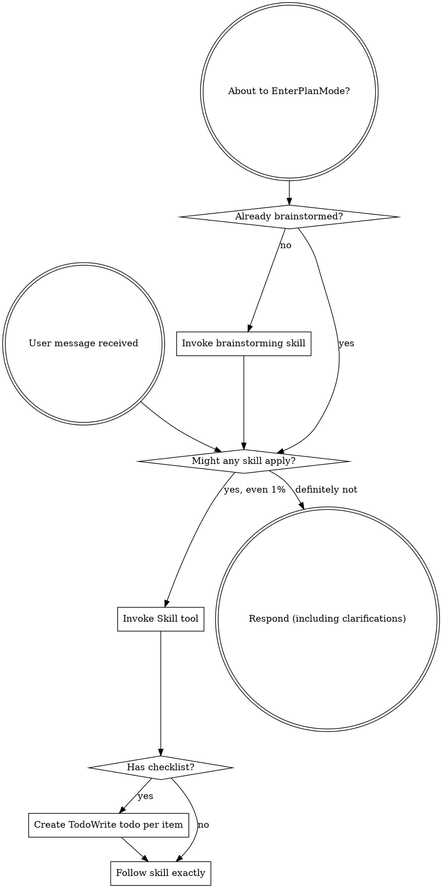

<SUBAGENT-STOP>
If you were dispatched as a subagent to execute a specific task, skip this skill.
</SUBAGENT-STOP>

<EXTREMELY-IMPORTANT>
If you think there is even a 1% chance a skill might apply to what you are doing, you ABSOLUTELY MUST invoke the skill.

IF A SKILL APPLIES TO YOUR TASK, YOU DO NOT HAVE A CHOICE. YOU MUST USE IT.

This is not negotiable. This is not optional. You cannot rationalize your way out of this.
</EXTREMELY-IMPORTANT>

## Instruction Priority

Chester skills override default system prompt behavior, but **user instructions always take precedence**:

1. **User's explicit instructions** (CLAUDE.md, direct requests) — highest priority
2. **Chester skills** — override default system behavior where they conflict
3. **Default system prompt** — lowest priority

If CLAUDE.md says "don't use TDD" and a skill says "always use TDD," follow the user's instructions. The user is in control.

## Session Housekeeping

At the start of every session:

1. **Verify jq availability:** Run `which jq`. If jq is not installed, warn: "Budget guard requires jq for JSON parsing. Install jq for token budget monitoring." Continue without the guard.

2. **First-run project configuration:** Check for project-scoped Chester config:
   ```bash
   eval "$(~/.claude/skills/chester-util-config/chester-config-read.sh)"
   ```
   If `CHESTER_CONFIG_PATH` is `none`, this is a new project. Run the first-run setup:

   a. Announce: "This looks like a new project for Chester. Let's set up your output directories."

   b. Present defaults and ask for confirmation or customization:
   ```
   Chester needs two directories for this project:

   Plans directory (committed archive): docs/chester/plans/
   Working directory (gitignored, for active docs): docs/chester/working/

   Accept defaults? Or enter custom paths.
   ```

   c. User accepts defaults or provides custom paths for either or both.

   d. Create both directories:
   ```bash
   mkdir -p "$CHESTER_WORK_DIR"
   mkdir -p "$CHESTER_PLANS_DIR"
   ```

   e. Ensure working directory is in `.gitignore`:
   ```bash
   if ! git check-ignore -q "$CHESTER_WORK_DIR" 2>/dev/null; then
     echo "$CHESTER_WORK_DIR/" >> .gitignore
     git add .gitignore
     git commit -m "chore: add chester working directory to .gitignore"
   fi
   ```

   f. Write project config:
   ```bash
   PROJECT_ROOT="$(git rev-parse --show-toplevel 2>/dev/null || pwd)"
   mkdir -p "$PROJECT_ROOT/.claude"
   ```
   Write to `$PROJECT_ROOT/.claude/settings.chester.local.json`:
   ```json
   {
     "working_dir": "<user's chosen working directory>",
     "plans_dir": "<user's chosen plans directory>"
   }
   ```
   Create user-level config if it doesn't exist:
   ```bash
   if [ ! -f "$HOME/.claude/settings.chester.json" ]; then
     echo '{}' > "$HOME/.claude/settings.chester.json"
   fi
   ```

   g. Announce: "Chester configured. Plans archived to `{plans_dir}`, working docs at `{working_dir}`."

   If `CHESTER_CONFIG_PATH` is not `none`, read silently and proceed. No announcement unless there's a problem (e.g., working directory missing from .gitignore — fix and warn).

## How to Access Skills

**In Claude Code:** Use the `Skill` tool.

# Using Skills

## The Rule

**Invoke relevant or requested skills BEFORE any response or action.** Even a 1% chance a skill might apply means that you should invoke the skill to check. If an invoked skill turns out to be wrong for the situation, you don't need to use it.



## Red Flags

These thoughts mean STOP — you're rationalizing:

| Thought | Reality |
|---------|---------|
| "This is just a simple question" | Questions are tasks. Check for skills. |
| "I need more context first" | Skill check comes BEFORE clarifying questions. |
| "Let me explore the codebase first" | Skills tell you HOW to explore. Check first. |
| "I can check git/files quickly" | Files lack conversation context. Check for skills. |
| "Let me gather information first" | Skills tell you HOW to gather information. |
| "This doesn't need a formal skill" | If a skill exists, use it. |
| "I remember this skill" | Skills evolve. Read current version. |
| "This doesn't count as a task" | Action = task. Check for skills. |
| "The skill is overkill" | Simple things become complex. Use it. |
| "I'll just do this one thing first" | Check BEFORE doing anything. |
| "This feels productive" | Undisciplined action wastes time. Skills prevent this. |
| "I know what that means" | Knowing the concept ≠ using the skill. Invoke it. |

## Skill Priority

When multiple skills could apply, use this order:

1. **Gate skills first** (`chester-design-figure-out`, `chester-design-specify`, `chester-plan-build`, `chester-execute-write`, `chester-finish`) — these define the overall pipeline stage and determine HOW to approach the task
2. **Review skills second** (`chester-plan-attack`, `chester-plan-smell`, `chester-util-codereview`) — these harden and validate the work
3. **Behavioral skills third** (`chester-execute-test`, `chester-execute-debug`, `chester-execute-prove`, `chester-execute-review`) — these guide specific execution disciplines
4. **Utility skills fourth** (`chester-util-worktree`, `chester-util-dispatch`) — these support workflow mechanics

"Let's build X" → `chester-design-figure-out` first, then `chester-design-specify`, then `chester-plan-build`.
"Write a spec for this" → `chester-design-specify` directly.
"Fix this bug" → `chester-execute-debug` first, then domain-specific skills.

## Skill Types

**Rigid** (`chester-execute-test`, `chester-execute-debug`): Follow exactly. Don't adapt away discipline.

**Flexible** (patterns): Adapt principles to context.

The skill itself tells you which.

## Available Chester Skills

- `chester-setup-start` — Entry point; establishes the pipeline and skill usage rules (this skill)
- `chester-design-figure-out` — Socratic discovery of design through structured dialogue
- `chester-design-architect` — Quantitatively-disciplined Socratic discovery with objective scoring, enforcement gating, and challenge modes
- `chester-design-specify` — Formalize approved designs into spec documents with automated review
- `chester-plan-build` — Write and harden implementation plans
- `chester-execute-write` — Execute plans, request code review, and perform subagent-driven development
- `chester-finish` — Finish a development branch and prepare for merge
- `chester-plan-attack` — Adversarial review of plans with five parallel attack agents
- `chester-plan-smell` — Forward-looking code smell analysis of an implementation plan
- `chester-util-codereview` — Lightweight code smell review of existing code scoped to a directory or path
- `chester-execute-test` — Test-driven development discipline
- `chester-execute-debug` — Systematic debugging workflow
- `chester-execute-prove` — Verification before completion
- `chester-execute-review` — Receiving and acting on code review feedback
- `chester-util-worktree` — Git worktree workflow for parallel branches
- `chester-util-dispatch` — Dispatching parallel subagents
- `chester-finish-write-session-summary` — Session summary after completing work
- `chester-finish-write-reasoning-audit` — Reasoning audit for decisions

## User Instructions

Instructions say WHAT, not HOW. "Add X" or "Fix Y" doesn't mean skip workflows.
