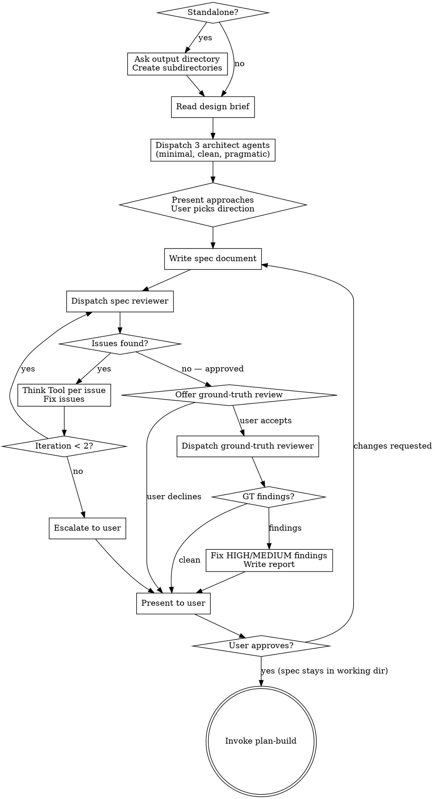

# Ground-Truth Review in Specify Stage — Implementation Plan

> **For agentic workers:** REQUIRED SUB-SKILL: Use execute-write (recommended) or execute-write in inline mode to implement this plan task-by-task. Steps use checkbox (`- [ ]`) syntax for tracking.

**Goal:** Add an opt-in ground-truth review step to `design-specify` that verifies spec claims against the actual codebase before the user review gate.

**Architecture:** Create a reviewer prompt template (`ground-truth-reviewer.md`) that adapts plan-attack's evidence-based adversarial discipline for spec-stage verification. Integrate it into `design-specify` as an optional step between the automated fidelity review and user review gate. Register the output artifact in the artifact schema.

**Tech Stack:** Markdown skill definitions, Chester artifact schema, subagent dispatch via Agent tool

---

### Task 1: Create Ground-Truth Reviewer Template

**Files:**
- Create: `skills/design-specify/ground-truth-reviewer.md`

This template follows the same pattern as `spec-reviewer.md` and `plan-reviewer.md` — a prompt template dispatched as a subagent. It adapts plan-attack's five review dimensions for spec-stage codebase verification.

- [ ] **Step 1: Verify the skill directory exists and review existing templates for pattern**

```bash
ls skills/design-specify/
```

Expected: `SKILL.md`, `spec-reviewer.md` — confirms directory exists and shows the template pattern to follow.

- [ ] **Step 2: Create the ground-truth reviewer template**

Create `skills/design-specify/ground-truth-reviewer.md` with this content:

```markdown
# Ground-Truth Reviewer Prompt Template

Use this template when dispatching a ground-truth reviewer subagent during the
optional ground-truth review step in design-specify.

**Purpose:** Verify the spec's claims about existing code against the actual codebase.
The spec fidelity reviewer checks whether the spec matches the *design brief*. This
reviewer checks whether the spec matches *reality*.

**Dispatch after:** The spec fidelity review loop passes.

` ` `
Task tool (general-purpose):
  description: "Ground-truth review of spec"
  prompt: |
    You are a ground-truth reviewer. Your job is to verify that this spec's claims
    about existing code are accurate by reading the actual source files.

    **Spec to review:** [SPEC_FILE_PATH]
    **Design brief for context:** [DESIGN_BRIEF_PATH]

    ## What You Are Checking

    The spec fidelity reviewer already confirmed this spec aligns with its design
    brief. You are checking a different dimension: does the spec align with the
    codebase?

    Read the spec. Identify every claim it makes about existing code — types,
    interfaces, method signatures, file paths, runtime behavior, counts of things,
    API contracts, constructor parameters, dependency chains.

    Then verify each claim against the actual source files.

    ## Review Dimensions

    | Dimension | What to Check |
    |-----------|---------------|
    | Factual accuracy | Do referenced types, files, interfaces, and APIs exist as described? Are file paths correct? Do class/method names match? |
    | Behavioral assumptions | Does the spec correctly describe how existing code behaves? Are return types, nullability, and error handling as claimed? |
    | Contract fidelity | Are API signatures, parameter lists, return types, and DI registrations accurate? Does the spec describe contracts that don't match their implementations? |
    | Completeness of references | Are there closely related types, files, or subsystems the spec should reference but doesn't? Would an implementer hit surprises from code the spec ignores? |
    | Latent interactions | Will the proposed changes interact with existing behavior in ways the spec doesn't address? Are there pre-existing bugs or edge cases that the spec's changes would expose? |

    ## Evidence Standard

    Every finding MUST cite:
    - A specific file path and line number (or range)
    - What the spec claims vs. what the code actually shows
    - Why the discrepancy matters for implementation

    If you cannot point to a specific file and line, drop the finding. Speculative
    concerns are not findings. This is the single most important rule.

    For claims you verify as correct, note them briefly — confirmed assumptions
    reduce uncertainty for the implementer.

    ## Severity Scale

    | Severity | Meaning |
    |----------|---------|
    | HIGH | Spec claim is factually wrong — implementation based on this claim will fail or produce incorrect behavior |
    | MEDIUM | Spec claim is misleading or incomplete — implementation will work but may include dead code, wrong counts, or unnecessary complexity |
    | LOW | Spec omits context that an implementer would benefit from knowing — latent bugs, edge cases, or adjacent code worth reading |

    ## Output Format

    ## Ground-Truth Review

    **Status:** Clean | Findings

    **Verified Claims:**
    - [Claim from spec] — CONFIRMED at [file:line]

    **Findings (if any):**
    - **[SEVERITY]: [One-line summary]**
      Spec says: "[what the spec claims]"
      Code shows: "[what actually exists]" — [file:line]
      Impact: [why this matters for implementation]

    **Risk Assessment:**
    [2-3 sentences: does this spec accurately describe the codebase it targets,
    are there areas to watch, or are there factual errors that should be fixed
    before planning?]
` ` `

**Reviewer returns:** Status, Verified Claims, Findings (if any), Risk Assessment
```

Note: The triple backticks inside the template use `` ` ` ` `` (spaced) in the outer document to avoid nesting conflicts. When implementing, use actual triple backticks for the inner code fence — the outer document wraps the whole template in a single code fence.

- [ ] **Step 3: Verify the file was created with correct structure**

```bash
head -5 skills/design-specify/ground-truth-reviewer.md
```

Expected: Shows the `# Ground-Truth Reviewer Prompt Template` header.

```bash
grep -c "Dimension" skills/design-specify/ground-truth-reviewer.md
```

Expected: At least 1 match confirming the review dimensions table is present.

- [ ] **Step 4: Commit**

```bash
git add skills/design-specify/ground-truth-reviewer.md
git commit -m "feat: add ground-truth reviewer template for spec-stage codebase verification"
```

---

### Task 2: Register Artifact Type in Schema

**Files:**
- Modify: `skills/util-artifact-schema/SKILL.md:104-114`

Add the `spec-ground-truth-report` artifact type to the artifact types table.

- [ ] **Step 1: Verify current artifact types table**

```bash
grep "plan-threat-report" skills/util-artifact-schema/SKILL.md
```

Expected: Shows the existing `plan-threat-report` row — confirms we're looking at the right table.

- [ ] **Step 2: Add the new artifact type**

In `skills/util-artifact-schema/SKILL.md`, locate the artifact types table (around line 104-114). Add a new row after `spec`:

```markdown
| `spec-ground-truth-report` | `spec/` | Ground-truth findings — codebase verification of spec claims | `design-specify` (ground-truth review) |
```

The table should now read (showing surrounding rows for context):

```markdown
| `spec` | `spec/` | Specification — formal requirements document | `design-specify` |
| `spec-ground-truth-report` | `spec/` | Ground-truth findings — codebase verification of spec claims | `design-specify` (ground-truth review) |
| `plan` | `plan/` | Implementation plan — task-by-task build instructions | `plan-build` |
```

- [ ] **Step 3: Verify the edit**

```bash
grep "spec-ground-truth-report" skills/util-artifact-schema/SKILL.md
```

Expected: Shows the new artifact type row.

- [ ] **Step 4: Commit**

```bash
git add skills/util-artifact-schema/SKILL.md
git commit -m "feat: add spec-ground-truth-report artifact type to schema"
```

---

### Task 3: Add Ground-Truth Review Step to design-specify

**Files:**
- Modify: `skills/design-specify/SKILL.md:23-34` (checklist)
- Modify: `skills/design-specify/SKILL.md:37-72` (process flow diagram)
- Modify: `skills/design-specify/SKILL.md:131-158` (review sections)
- Modify: `skills/design-specify/SKILL.md:169-176` (integration section)

This is the main integration task. It adds the ground-truth review as an opt-in step, updates the process flow, and adjusts the integration section.

- [ ] **Step 1: Verify current checklist structure**

```bash
grep -n "Automated spec review\|User review gate\|Transition" skills/design-specify/SKILL.md
```

Expected: Shows steps 5, 6, 7 with their current numbering — confirms the insertion point.

- [ ] **Step 2: Update the checklist**

In the `## Checklist` section, add a new step 6 between the current steps 5 and 6, and renumber:

Current:
```markdown
5. **Automated spec review loop** — dispatch spec-document-reviewer subagent with design brief, Think Tool gate per issue, fix and re-dispatch (max 2 iterations, then escalate to user)
6. **User review gate** — present clean spec to user for review; if changes requested, apply and loop back to step 5
7. **Transition** — invoke plan-build (spec is NOT committed here — `finish-archive-artifacts` copies all artifacts into the worktree for merge)
```

After:
```markdown
5. **Automated spec review loop** — dispatch spec-document-reviewer subagent with design brief, Think Tool gate per issue, fix and re-dispatch (max 2 iterations, then escalate to user)
6. **Ground-truth review (opt-in)** — after fidelity review passes, offer codebase verification; if accepted, dispatch ground-truth-reviewer subagent, fix HIGH/MEDIUM findings, write report to `spec/` subdirectory
7. **User review gate** — present clean spec (and ground-truth report if generated) to user for review; if changes requested, apply and loop back to step 5
8. **Transition** — invoke plan-build (spec is NOT committed here — `finish-archive-artifacts` copies all artifacts into the worktree for merge)
```

- [ ] **Step 3: Update the process flow diagram**

Replace the current `digraph build_spec` with an updated version that includes the ground-truth review path. Add these nodes after `"Present to user"` setup and before the user approval diamond:



- [ ] **Step 4: Add the Ground-Truth Review section**

After the `## Automated Spec Review Loop` section and before `## User Review Gate`, add:

```markdown
## Ground-Truth Review (Opt-In)

After the spec fidelity review passes, offer the ground-truth review:

> "Spec fidelity review passed. Would you like to run a ground-truth review to verify
> spec claims against the actual codebase? This is recommended for specs that reference
> existing types, APIs, file paths, or runtime behavior. Skip for greenfield specs with
> no existing code references."

If the user declines, proceed directly to the user review gate.

If the user requests changes at the user review gate and the flow loops back through the fidelity review, do not re-offer the ground-truth review if it already ran in this session — proceed directly to the user review gate unless the user's changes materially alter code references.

If the user accepts:

1. Dispatch ground-truth-reviewer subagent (see ground-truth-reviewer.md in this skill directory)
   - Provide: spec path AND design brief path
   - The subagent reads source files to verify every claim the spec makes about existing code
2. On return, evaluate findings by severity:
   - **HIGH findings:** Fix the spec (increment version per `util-artifact-schema`). Re-run the ground-truth review only — do not re-run the fidelity review, since the fix targets codebase accuracy, not brief alignment. Exception: if the fix changes the spec's architectural approach (not just correcting a reference), re-run the fidelity review as well.
   - **MEDIUM findings:** Fix the spec. No re-review needed unless the fix is substantial.
   - **LOW findings:** Note in the report. Do not fix the spec — these are context for the implementer.
   - **Iteration cap:** If the ground-truth review loop exceeds 2 iterations, escalate to user for guidance — matching the fidelity review pattern.
3. Write the ground-truth report to the `spec/` subdirectory as `{sprint-name}-spec-ground-truth-report-00.md` (see `util-artifact-schema`)
4. Present the report summary to the user alongside the spec at the user review gate

The ground-truth report is preserved as an artifact. In a future iteration, `plan-build`
could pass the ground-truth report to plan-attack to reduce redundant verification at the
plan stage — but that is out of scope for this change.
```

- [ ] **Step 5: Update the User Review Gate section**

Modify the user review gate message to mention the ground-truth report when present:

Current:
```markdown
> "Spec written and reviewed at `{path}`. Please review and let me know if you want changes before we proceed to the implementation plan."
```

After:
```markdown
> "Spec written and reviewed at `{path}`. Please review and let me know if you want changes before we proceed to the implementation plan."

If a ground-truth review was performed, also present:

> "Ground-truth review report at `{report-path}`. [N] findings ([breakdown by severity]). [1-sentence risk summary from report]."
```

- [ ] **Step 6: Update the Integration section**

Current (line 169-176):
```markdown
## Integration

- **Calls:** `start-bootstrap` (standalone only)
- **Reads:** `util-artifact-schema` (naming/paths), `util-design-brief-template` (brief structure reference), `util-budget-guard`
- **Invoked by:** design-figure-out (primary), or user directly (standalone)
- **Transitions to:** plan-build
- **Does NOT invoke:** plan-attack, plan-smell, or any implementation skill
```

After:
```markdown
## Integration

- **Calls:** `start-bootstrap` (standalone only)
- **Dispatches:** ground-truth-reviewer subagent (opt-in, after fidelity review)
- **Reads:** `util-artifact-schema` (naming/paths), `util-design-brief-template` (brief structure reference), `util-budget-guard`
- **Invoked by:** design-figure-out (primary), or user directly (standalone)
- **Transitions to:** plan-build
- **Does NOT invoke:** plan-attack, plan-smell, or any implementation skill
```

Note: The ground-truth reviewer is dispatched as a general-purpose subagent using the template, not by invoking the plan-attack skill. This preserves the "Does NOT invoke: plan-attack" boundary — the reviewer shares plan-attack's *discipline* (evidence standard, severity model) but is a separate dispatch with a spec-specific prompt.

- [ ] **Step 7: Verify the edits**

```bash
grep -n "Ground-truth\|ground-truth\|GT findings" skills/design-specify/SKILL.md
```

Expected: Multiple matches showing the new step in the checklist, flow diagram, review section, and integration section.

```bash
grep "Does NOT invoke" skills/design-specify/SKILL.md
```

Expected: Still shows "plan-attack, plan-smell" — confirming we preserved the boundary.

- [ ] **Step 8: Commit**

```bash
git add skills/design-specify/SKILL.md
git commit -m "feat: add opt-in ground-truth review step to design-specify"
```

---

### Task 4: Update Skill Descriptions (CLAUDE.md Sync Convention)

**Files:**
- Modify: `skills/design-specify/SKILL.md:3` (YAML frontmatter description)
- Modify: `skills/setup-start/SKILL.md:248` (available skills list)

CLAUDE.md requires: "If you change what a skill does, update both [the SKILL.md description and setup-start's available skills list]."

- [ ] **Step 1: Update design-specify frontmatter description**

In `skills/design-specify/SKILL.md`, line 3, update the description:

Current:
```yaml
description: "Formalize an approved design into a durable spec document. Use when a design brief exists (from design-figure-out, a whiteboard, a previous session, or a human-written brief) and needs to be written as a formal spec with automated review."
```

After:
```yaml
description: "Formalize an approved design into a durable spec document. Use when a design brief exists (from design-figure-out, a whiteboard, a previous session, or a human-written brief) and needs to be written as a formal spec with automated review and optional codebase verification."
```

- [ ] **Step 2: Update setup-start available skills list**

In `skills/setup-start/SKILL.md`, find the line (around line 248):
```markdown
- `design-specify` — Formalize approved designs into spec documents with automated review
```

Replace with:
```markdown
- `design-specify` — Formalize approved designs into spec documents with automated review and optional codebase verification
```

- [ ] **Step 3: Verify both descriptions match**

```bash
grep "design-specify" skills/design-specify/SKILL.md | head -1
grep "design-specify" skills/setup-start/SKILL.md | grep -v "^1\."
```

Expected: Both mention "optional codebase verification."

- [ ] **Step 4: Commit**

```bash
git add skills/design-specify/SKILL.md skills/setup-start/SKILL.md
git commit -m "chore: sync design-specify description with ground-truth review capability"
```

---

### Task 5: Cross-Reference Verification

**Files:**
- Read: `skills/design-specify/SKILL.md`
- Read: `skills/design-specify/ground-truth-reviewer.md`
- Read: `skills/util-artifact-schema/SKILL.md`

Final consistency check across all modified files.

- [ ] **Step 1: Verify artifact name consistency**

```bash
grep "spec-ground-truth-report" skills/design-specify/SKILL.md skills/util-artifact-schema/SKILL.md
```

Expected: The artifact name appears in both files, spelled identically.

- [ ] **Step 2: Verify reviewer template is referenced correctly**

```bash
grep "ground-truth-reviewer.md" skills/design-specify/SKILL.md
```

Expected: At least one reference pointing to the template file in the same directory.

- [ ] **Step 3: Verify the output directory is consistent**

```bash
grep "spec/" skills/design-specify/ground-truth-reviewer.md skills/util-artifact-schema/SKILL.md | grep -i "ground-truth"
```

Expected: Both files agree the report goes in `spec/`.

- [ ] **Step 4: Verify step numbering is sequential**

```bash
grep -E "^[0-9]+\." skills/design-specify/SKILL.md | head -10
```

Expected: Steps 1-8 in order, no gaps or duplicates.

- [ ] **Step 5: Final commit (if any fixes needed)**

Only if cross-reference verification found issues:

```bash
git add -A
git commit -m "fix: resolve cross-reference inconsistencies in ground-truth review"
```
