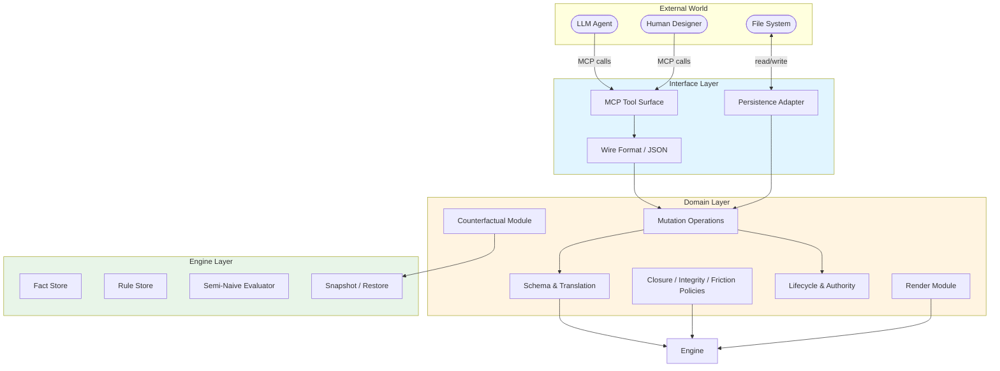
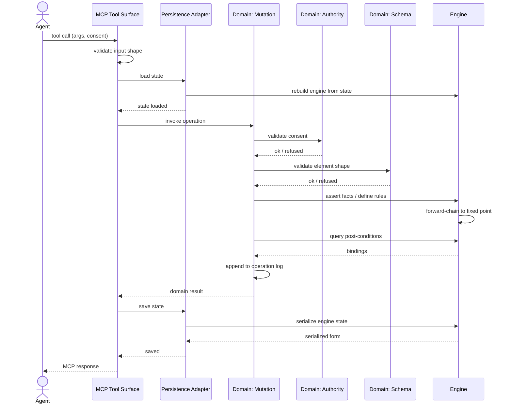
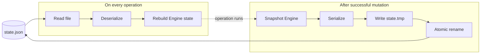
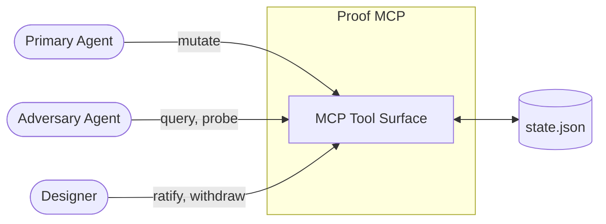

# Architecture

This document describes the structural shape of the proof system: its layers, their dependencies, what each layer owns, and the contracts at each boundary. It is the bridge between the philosophy (Vision, ConOps) and the implementation (Specs).

---

## 1. Architectural style

The system uses **hexagonal architecture** (Ports and Adapters) with three layers. The Domain layer sits at the center; the Engine and Interface are adapters bound to the Domain through typed ports.

The architectural style is chosen because:
- **The Domain is the system's identity.** Proof concepts, lifecycle, policies, channeling — these are what make this system this system. They sit at the center.
- **The Engine is replaceable.** Today it is a custom Datalog evaluator. Tomorrow it might be CozoDB or Soufflé. The Domain should not care.
- **The Interface is replaceable.** Today it is MCP. Tomorrow it might be HTTP or a CLI. The Domain should not care.
- **Dependencies flow inward only.** Engine and Interface depend on Domain abstractions; Domain depends on Engine through a port; Domain knows nothing about Interface.

The MVVM analogy works at high level (Engine ≡ Model, Domain ≡ ViewModel, Interface ≡ View) but the precise pattern is hexagonal because there is no UI binding and the Engine is itself an adapter rather than a passive store.

---

## 2. Layer overview

### 2.1 Engine Layer
Pure Datalog evaluator. Generic over predicate symbols and value types. Knows nothing about proofs, designers, or agents. Provides facts, rules, queries, derivation, snapshots.

### 2.2 Domain Layer
The proof system's identity. Owns the design language schema, mutation operations, closure policy, integrity policy, friction policy, lifecycle, authority enforcement, restructuring, rendering, counterfactual reasoning. Uses the Engine for inference; exposes proof-shaped operations to the Interface.

### 2.3 Interface Layer
Adapter between the outside world and the Domain. Owns the MCP tool surface, JSON wire format, file persistence, error classification, render adapters. Knows nothing about closure conditions, friction logic, or Datalog semantics.

### 2.4 Adapter inventory

The layering admits a wider implementation space than the initial build commits to. The table below enumerates the adapters the architecture supports; the initial implementation ships the **primary** adapter in each row, and the alternatives become available without changing layer contracts.

**Engine layer adapters (substrate)**

| Adapter | Status | When to pick it |
|---|---|---|
| Custom semi-naive evaluator (JS) | Primary | Default; small fact bases; no external dependencies; license-clean (ADR-0002) |
| CozoDB via Node bindings | Alternative | Large proofs; advanced query optimization; MPL-2.0 acceptable |
| Soufflé compiled Datalog | Alternative | Very large proofs; latency-critical; native-binary tolerance |
| SQLite recursive-CTE | Alternative | Constrained environments where SQLite is already present |
| In-memory mock | Test | Unit tests; deterministic; no real evaluation |

**Interface layer adapters (delivery)**

| Adapter | Status | When to pick it |
|---|---|---|
| MCP | Primary | Claude Code integration; the proof's primary client surface |
| CLI (`chester-proof <verb>`) | Planned | Terminal workflows; scripting; CI integration |
| HTTP / REST | Possible | Multi-client deployments; web UI backends |
| IDE plugin (VS Code / JetBrains) | Possible | Inline ratification alongside code |
| Test harness (programmatic) | Test | Direct Domain invocation without protocol overhead |
| Audit-log streamer | Possible | Read-only forensic analysis over operation log |

**Cross-cutting adapters**

| Port | Primary adapter | Alternatives |
|---|---|---|
| Persistence | JSON file (atomic write via rename) | SQLite store; network store; in-memory |
| Consent verification | Strict (per RULE-16 hooks) | Permissive (for testing); audit-trail only |
| Clock (`IClock`) | Real clock + scoped counter | Deterministic (tests); replay (forensic) |
| ID allocation (`IIDAllocator`) | Sequential-per-category | UUID; deterministic (tests); namespaced |

The inventory is illustrative, not exhaustive. New adapters can be added at any layer without disturbing the others, provided they satisfy the relevant port contract (§4).

---

## 3. The inward dependency rule

Dependencies flow inward only:
- **Interface depends on Domain.** It calls Domain operations; it shapes Domain results for the wire.
- **Domain depends on Engine.** It asserts facts and rules; it issues queries; it consumes bindings and derivation trees.
- **Engine depends on nothing.** It is generic and self-contained.

Forbidden:
- Interface calling Engine directly (must go through Domain)
- Domain reading the wire format or filesystem (Persistence and Wire shape live in Interface)
- Engine knowing about Concerns, Propositions, or any proof-domain concept

The discipline is structural: each layer exposes a typed surface; outer layers call into inner layers through that surface; inner layers know nothing of outer layers.

---

## 4. Named ports

The boundaries between layers are not just "what flows down / up" — they are **named interfaces** that adapters implement. Each port has a narrow, role-specific surface. An adapter implements only the ports it needs; this is Interface Segregation as a structural property of the architecture, not a slogan.

A port is defined by the surface it exposes (the operations it provides) and the contract its implementations must honor (pre/post conditions, error semantics, atomicity). Adapters behind a port are substitutable: replacing the JSON-file persistence adapter with a SQLite adapter does not change the Domain's behavior.

### 4.1 Substrate-facing ports (Domain → Engine)

The Domain accesses the Engine through six role-segregated ports. The split is finer than it strictly has to be at small adapter counts — but it is what lets read-only clients (audit tools, the Adversary, alternate render adapters) take narrow dependencies that match what they actually use, which is Interface Segregation as a structural property rather than as a slogan. (See ADR-0012 for the rationale behind the split; ADR-0013 amends it by relocating `IMaterializer` to the Domain layer.)

- **`IFactStore`** — base-fact lifecycle. Surface: `assertFact(predicate, args)`, `retractFact(predicate, args)`, `factExists(predicate, args)`. The Domain asserts element facts and retracts them on withdrawal.

- **`IRuleStore`** — rule lifecycle. Surface: `defineRule(ruleId, head, body, metadata)`, `undefineRule(ruleId)`, `getRule(ruleId)`. The Domain registers element rules (for Propositions, Resolutions, etc.) and integrity / closure / friction rules. Stratification analysis runs at `defineRule` time; cyclic-negation rule sets are rejected at definition rather than at evaluation.

- **`IQueryEngine`** — query evaluation. Surface: `derive()`, `query(pattern)`, `count(pattern)`, `exists(pattern)`. The Domain issues queries against the derived knowledge base. Excludes explanation and snapshot/restore (split into their own ports below).

- **`ISnapshotRestore`** — counterfactual primitive. Surface: `snapshot() → token`, `restore(token)`. The Domain wraps counterfactual operations (`snapshot(); retractFact(...); derive(); query(...); restore(snap);`) for collapse-test verification (Domain Spec §11) and per-element "would closure still hold without this?" queries.

- **`IExplain`** — derivation tracing. Surface: `explain(fact) → tree`. Produces a derivation tree for a derived fact, naming each body literal that supports it. Consumed by the render layer to answer "why does this Proposition count?" and by the Adversary to probe inference chains. Split from `IQueryEngine` because read-only auditing clients depend on it without depending on bulk query capability, and because not every substrate emits derivation trees (a SQLite recursive-CTE adapter, for example, may not — the port admits a graceful unsupported path).

- **`ITransaction`** — atomicity. Surface: `begin() → handle`, `commit(handle)`, `rollback(handle)`. The Domain wraps multi-fact operations to guarantee that the Engine state either fully advances or fully reverts. (See ADR-0009.)

**Adapter implementability.** A read-only audit adapter implements `IQueryEngine`, `IExplain` only — it does not pull in `IFactStore`, `IRuleStore`, `ISnapshotRestore`, or `ITransaction`. (When it needs a stable corpus across multiple reads, it calls `IQueryEngine.query` once and holds the result locally; materialization is a Domain composition concern per ADR-0013, not a substrate port.) The Adversary depends on `IQueryEngine`, `IExplain`, and `ISnapshotRestore` (counterfactual probing of presented proofs). The primary Domain implementation depends on all six. The mock substrate used in unit tests implements `IFactStore`, `IRuleStore`, `IQueryEngine`, `ITransaction` and stubs the remaining two.

### 4.2 Delivery-facing ports (Interface → Domain)

The Interface accesses the Domain through ports segregated by use-case family. Each port has a focused responsibility; adapters can implement subsets.

- **`IElementMutation`** — `addElement`, `reviseElement`, `withdrawElement`. The generic element-mutation surface, dispatched internally by category.

- **`IRatification`** — `ratifyElement`. The Designer-only ratification verb, unified across element categories.

- **`IFrictionManagement`** — `addFriction`, `overrideFrictionDisposition`. Cross-element tension management.

- **`IDefinitionManagement`** — `addDefinition`, `reviseDefinition`, `ratifyDefinition`, `deprecateDefinition`, `queryOverlap`. Vocabulary management.

- **`IClosureSurface`** — `presentClosingArgument`, `confirmClosureGo`. The two-yes ratification protocol.

- **`IRenderSurface`** — `renderStructuredProof`, `renderElementDeep`, `renderClosingArgument`, `renderDatalogProjection`, `renderLaneSlice` (queries the derived `in_lane` predicate per ADR-0011). Read-only; no consent token required.

- **`IQuerySurface`** — `getProofState`, `queryProof`, `runCounterfactual`. Read-only structured access to state and engine.

Each port is independently implementable. A read-only audit tool implements `IRenderSurface` and `IQuerySurface` only. A test harness might implement `IElementMutation` and `IRatification` while skipping `IFrictionManagement` and `IDefinitionManagement`.

### 4.3 Cross-cutting ports

Ports that don't bind cleanly to a single layer transition. These wire at session-boundary, injected by the Interface layer when it constructs the Domain bridge.

- **`IConsentVerification`** — shape-validates and source-validates consent tokens; constructs verified-consent handles that Domain mutations accept. (Living at the Interface ↔ Domain boundary; the Domain trusts that verification has happened.)

- **`IPersistenceRepository`** — `loadState() → state`, `saveState(state)`. The Domain bridge invokes this at session boundaries; the Interface implements it.

- **`IClock`** — `now() → instant`, `currentRound() → int`, `advanceRound() → int`. Injected for determinism. (See ADR-0009.)

- **`IIDAllocator`** — `next(category) → string`. Injected for testability and substitutable allocation strategies. (See ADR-0009.)

### 4.4 External ↔ Interface boundary

The system's outer boundary, not a Domain-facing port:

**In:**
- MCP tool calls with JSON arguments
- File reads (state files)

**Out:**
- MCP tool responses with JSON content
- File writes (state files, atomic via rename)

The Interface owns this boundary entirely. No part of the Domain or Engine touches files, processes, or network.

### 4.5 What the named-port discipline forbids

- Engine reading Domain state directly (the Domain pushes facts into the Engine; the Engine never pulls)
- Domain reaching into Engine internals (indexes, evaluator state)
- Interface building engine queries directly (always go through Domain)
- Domain reading JSON or filesystem (Persistence and Wire shape live in Interface)
- Domain knowing MCP tool names or message formats
- Any port surfacing more operations than its narrow role requires (Interface Segregation discipline)

These prohibitions are what make the architecture's payoffs (§10) realizable rather than aspirational.

---

## 5. Canonical mutation flow

The most common operation flow: Agent issues a mutation.

The flow is uniform across operations. Variations are in which Domain modules are invoked (mutations vs renders vs counterfactuals) but the layer transitions follow this pattern.

### 5.1 End-to-end walkthrough: `ratify` operation

To make the boundaries concrete, follow `ratify(state_file, element_id, ratification_text, consent)` step by step. This is the operation that touches the most ports (authority, transaction, derivation, integrity, persistence) in one flow.

**Step 1 — User invocation.** Designer says "accept" in the conversation. The MCP adapter receives a tool call from the model; the call carries `state_file`, `element_id` (e.g., `prop_3`), `ratification_text`, `consent`.

**Step 2 — Interface pre-checks.** The MCP handler validates the JSON shape against the tool's schema. If malformed, it returns a structured error without crossing into the Domain. If well-formed, proceeds.

**Step 3 — Consent verification.** The Interface invokes `IConsentVerification` to validate the consent token. For `ratify`, the verifier enforces that `consent.source` is `designer`. On success, a `VerifiedConsent` handle is constructed.

**Step 4 — State load.** The Interface invokes `IPersistenceRepository.loadState(state_file)`. The state arrives as a Domain-shaped object. The Domain bridge rebuilds the Engine: every persisted fact is asserted; every persisted rule is defined.

**Step 5 — Domain entry.** The Interface calls `IRatification.ratifyElement(elementId, ratificationText, verifiedConsent)` on the Domain.

**Step 6 — Transaction begin.** The Domain opens an engine transaction: `engine.begin() → txHandle`. Subsequent assertions are buffered until commit.

**Step 7 — Pre-condition check.** The Domain queries the Engine: `query(active_element(prop_3))` to confirm the element is active; `query(not approved(prop_3, _, _))` to confirm it isn't already approved; `query(not finished())` to confirm the proof isn't closed. If any check fails, the Domain rolls back the transaction and returns a domain-classified error.

**Step 8 — Authority check.** The Domain validates that `verifiedConsent.source == "designer"` for this operation category. (Redundant with the Interface's earlier check but defensive: each layer enforces its own contract.)

**Step 9 — Assertion.** The Domain asserts the approval fact: `engine.assertFact("approved", [prop_3, ratificationText, currentRound])`. With `ITransaction`, the assertion is buffered.

**Step 10 — Derivation.** The Domain calls `engine.derive()`. The Engine re-evaluates: the rule `proposition(prop_3, S) :- ..., approved(prop_3, _, _)` now satisfies its body and produces a derived `proposition` fact; any Resolution that grounded in `prop_3` may now also derive; cascade propagates through fixed point.

**Step 11 — Integrity recomputation.** The Domain queries integrity predicates: `query(ungrounded_proposition(_))`, `query(withdrawn_grounding(_, _))`, etc. The Engine returns current bindings. If any binding is unexpected (i.e., the ratification introduced an integrity violation), the Domain rolls back and returns an error.

**Step 12 — Closure recomputation.** The Domain queries `closure_permitted` and per-condition predicates. The result becomes part of the response payload but does not gate the operation.

**Step 13 — Operation log append.** The Domain appends an entry: `{round, op: "ratify", entity_id: prop_3, consent: verifiedConsent, changedFields: ["approval"]}`.

**Step 14 — Round advance.** The Domain calls `IClock.advanceRound()`.

**Step 15 — Mutation-clears-flags.** The Domain retracts `closing_arg_presented(_)` and `closing_arg_go(_)` (defensive: this operation is itself a ratification, not a presentation, so any prior presentation is now stale).

**Step 16 — Transaction commit.** `engine.commit(txHandle)`. The Engine state is now durably advanced.

**Step 17 — Persistence save.** The Domain bridge calls `IPersistenceRepository.saveState(newState)`. The adapter serializes, writes to `state.tmp`, fsyncs, and atomically renames.

**Step 18 — Result construction.** The Domain returns a result: new round, new phase, ratification record, current closure status.

**Step 19 — Interface response.** The MCP handler formats the result as the tool response shape and returns it through the MCP runtime.

**Transaction-visibility note.** The queries at steps 7, 11, and 12 all execute *inside* the transaction opened at step 6. Step 7's pre-condition queries see the committed state (the buffer is still empty); steps 11 and 12 see the committed state plus the transaction's buffered mutations from step 9 (the just-asserted approval and any cascade derived from it). This is the read-own-writes contract specified in Engine Spec §4.8 (per ADR-0013): inside an open transaction, the engine's logical EDB is `(committed ∪ buffered-asserts) − buffered-retracts`, and `query` triggers `derive()` against that logical view when the state is non-derived. The walkthrough's correctness depends on this contract.

**Boundary observations.** Steps 1–4 are Interface (consent shape, MCP semantics, file I/O). Steps 5–16 are Domain (no awareness of MCP or files). Steps 6, 9, 10, 11, 12, 16 cross the substrate ports (`ITransaction`, `IFactStore`, `IQueryEngine`). Steps 4 and 17 cross the persistence port. Each port crossing is a contract; each contract has stable shape; each adapter behind a port is replaceable without disturbing the cores.

---

## 6. Cross-cutting concerns

Some concepts span layers. The architecture documents their placement once here; specs do not redefine them.

### 6.1 Consent tokens
- **Interface**: shape validation only (token present, has source field)
- **Domain**: semantic validation (source allowed for this operation, rationale meets requirements)
- **Engine**: consent appears as opaque metadata args on facts; Engine ignorant of meaning

### 6.2 Operation log
- **Domain**: owns the log structure; appends on every successful mutation
- **Interface**: persists the log as part of state file
- **Engine**: not aware

### 6.3 Rounds and phases
- **Domain**: round counter, phase computation, body-advancement detection
- **Engine**: round appears as a value in fact arguments; not interpreted
- **Interface**: surfaces round in tool responses

### 6.4 Action labels
- **Domain**: assigned during restructuring or mutation; attached to facts as metadata
- **Engine**: carries labels transparently; does not reason about them
- **Interface**: receives labels in tool inputs; reports them in tool outputs

### 6.5 Provenance and citations
- **Engine**: produces derivation trees on `explain()`
- **Domain**: wraps trees with action-label metadata, restructuring lineage, ratification history
- **Interface**: formats provenance for the wire

### 6.6 Approval (ratification)
- **Engine**: approval is a regular fact (`approved/3`) with no special semantics
- **Domain**: enforces that approval is required for elements to enter the derived set (via body literals in element rules); cascades on revision; tracks approval history
- **Interface**: exposes approval as the `ratify` MCP tool

### 6.7 Clock and round counter (`IClock`)
- **Engine**: round appears as a fact argument (`current_round/1`); not interpreted
- **Domain**: depends on `IClock` for `now()`, `currentRound()`, `advanceRound()`; never reads time directly
- **Interface**: constructs the clock adapter; injects into the Domain bridge at session start

The default adapter pairs real-clock timestamps with an in-memory counter scoped to the loaded proof. Tests inject a deterministic clock. See ADR-0009.

### 6.8 ID allocation (`IIDAllocator`)
- **Engine**: receives IDs as opaque fact arguments
- **Domain**: depends on `IIDAllocator.next(category)`; never generates IDs inline
- **Interface**: constructs the allocator adapter; persists allocator state alongside proof state

The default adapter is sequential-per-category (`evid_1`, `evid_2`, …). Tests inject a deterministic adapter. Future multi-author proofs could use UUID or namespaced allocators without Domain changes. See ADR-0009.

### 6.9 Transactional atomicity (`ITransaction`)
- **Engine**: provides `begin / commit / rollback`. For the custom evaluator, implemented as buffer-and-commit; for native-transactional substrates, passes through to the underlying mechanism.
- **Domain**: wraps every multi-fact mutation in `begin → assert / define / retract → commit on success, rollback on failure`
- **Interface**: not aware of transactions; sees only the Domain's success-or-error result

This makes multi-fact atomicity an explicit contract rather than an implicit assumption. See ADR-0009.

---

## 7. State persistence model

The proof's state is durable: persisted to a JSON file per atomic mutation.

Properties:
- **Atomic writes**: temp file plus rename guarantees no partial state on crash
- **Schema versioning**: state files carry a schema version; loadState backfills missing fields for compatibility
- **No in-memory persistence between operations**: each MCP call loads fresh, mutates, saves, returns. No long-lived process state.

This means the engine is rebuilt on every operation. For proofs at the expected scale (low thousands of facts), this is fast; if proofs grow larger, the architecture admits a cached-engine optimization without changing layer contracts.

---

## 8. Adversary integration (future)

The Adversary role attaches at the Interface layer as just another client. It reads the Datalog projection of state via a query tool and submits attack patterns through the same MCP surface as the primary Agent.

The Adversary is structurally indistinguishable from any other client. Its role is enforced by what it does, not by special privileges. Tools available to the Adversary include:
- `query_proof` — ad-hoc Datalog queries against the projection
- `runCounterfactual` — collapse_test verification
- `withdraw` — with appropriate disposition (typically `found-incorrect`)
- `manage_friction` — to register tensions the Agent missed

The architecture does not yet wire the Adversary's specific behaviors; it is anticipated to live as a separate skill or process invoking the proof MCP.

---

## 9. What this architecture does NOT prescribe

To keep the architecture document focused, several things are deferred to specifications or operational decisions:

- **Implementation language.** The Domain and Interface are written in JavaScript currently; the Engine could be JS or WASM-bridged native. Layer choices do not depend on language.
- **Specific Datalog dialect.** Decided in the Engine Spec.
- **Specific MCP tool list.** Decided in the Interface Spec.
- **Specific closure conditions.** Decided in the Domain Spec.
- **Specific schemas per element type.** Decided in the Domain Spec.

This document specifies the *shape*; the specs supply the *content*.

---

## 10. Architectural payoffs

The hexagonal layering pays off in:

- **Engine reusable**: the Datalog evaluator can ship as a separate package; other tools that want forward-chaining over typed facts can use it.
- **Domain testable without Interface**: the Domain has a programmatic surface; tests can exercise it without going through MCP.
- **Interface replaceable**: switching from MCP to HTTP is a Interface-layer change; Domain and Engine untouched.
- **Counterfactuals come for free**: the snapshot/restore primitive at Engine level lets the Domain implement collapse_test verification without bespoke machinery.
- **Independent verification path**: the Datalog projection of state can be loaded into a different engine for independent confirmation; the architecture admits this as a first-class adapter.
- **Adversary integrates cleanly**: the Adversary uses the same Interface as the primary Agent; no special privileges or pathways needed.

---

## 11. What this architecture costs

The system pays real costs for the layering. These are not regrets — they are the dual of the payoffs in §10 — but they should be named, not papered over.

### 11.1 Indirection

A mutation flows through three layers. For a system whose primitives are simple, this is more ceremony than a single-module implementation would be. Tooling that traces calls across the layers (logging, debugging, structured exceptions) is essential.

### 11.2 Discipline required

Contributors must respect the inward dependency rule and the named-port discipline. Slipping (e.g., Interface calling Engine directly; Domain reading the wire format) corrupts the architecture's value silently — the layering still appears intact but the substitutability and testability properties degrade. Mitigated by code review, by per-layer test suites (Test Strategy §2–§4), and by the named-port discipline making violations more visible.

### 11.3 Datalog learning curve

Maintainers must know Datalog or be willing to learn it. Debugging derivation chains is qualitatively different from debugging procedural code; answers come back, but the path is implicit. Mitigation: the `explain()` operation (Engine Spec §4.5) returns derivation trees showing why a fact was derived. Well-commented rule sets tie clauses to domain rules. The narrow stratified-Datalog dialect (Engine Spec §2) bounds the conceptual surface.

### 11.4 Engine choice is partially locked-in

The Engine is replaceable in principle, but the Domain's queries and rules are written for a specific dialect (stratified Datalog with the operations in Engine Spec §4). Switching to a substrate with different semantics (e.g., a graph database without stratified negation) requires rewriting Domain queries. The architecture admits substitution within Datalog's family but not arbitrary substitution.

### 11.5 Persistence format must outlive substrate choices

If the substrate is ever swapped, the persistence format must remain readable by both old and new substrate adapters. The Domain's persisted format is the contract; the substrate is transient. This is the cleanest version of the trade-off but requires discipline — the persistence schema is load-bearing and must be versioned (`schemaVersion` in the state file).

### 11.6 Persistence latency

Rebuilding the Engine on every operation has a fixed cost. At expected scale (low thousands of facts), this is acceptable; at larger scale, requires optimization (in-memory engine caching across operations, with persistence as a write-behind). The architecture admits this optimization without changing layer contracts.

### 11.7 Round counter as global state

The round counter is monotonically increasing per-proof state. In a single-session, single-process world this is trivial. In a multi-session or distributed world (an architectural future the current design does not commit to), the counter becomes a coordination problem. The `IClock` port (§6.7, ADR-0009) is the substitution point if this changes.

### 11.8 Consent verification is an irreducible trust boundary

Consent semantics ("source MUST be designer for ratification") cannot be verified inside the proof system itself — they depend on the Interface layer's honest reporting of who originated the call. A malicious or buggy Interface could forge designer-sourced consent and the Domain has no way to detect it. The architecture preserves this trust boundary by isolating it: consent shape and verification live at the Interface boundary; the Domain accepts a verified-consent handle and trusts it. Out-of-band auditing (transcript review, plugin-layer hooks) is the only structural fix and remains outside the proof system's boundary.

### 11.9 Forward-solve alternative not adopted

ADR-0007 commits to Propositions and Resolutions as derivable rules with approval as a body literal. The alternative — entities with state fields, procedural mutation, integrity warnings as derived facts but ratification as state — is a legitimate architecture that this project explicitly does not adopt. The cost is the paradigm commitment: reversing this decision after migration would require rewriting Engine-resident logic procedurally. The benefit is free cascade, free counterfactuals, and the deeper "proof is a derivation" theory.

### 11.10 Transactional semantics across layers

The Engine has its own transaction model; Datalog evaluators differ in how they handle concurrent assertions and partial-failure semantics. The Domain's use cases need atomicity for multi-fact mutations (e.g., revising a Proposition plus invalidating dependent integrity claims; ratifying an element plus clearing the two-yes flags). The cleanest answer is the layered one: the Domain wraps multi-fact operations in `ITransaction.begin` / `commit` / `rollback`; the substrate adapter implements transaction semantics consistent with the underlying engine. For substrates without native transactions, the adapter buffers and commits atomically at the boundary. The cost is that transactional behavior becomes adapter-specific: switching substrates requires re-validating that the adapter preserves the Domain's atomicity expectations, not just that it preserves query semantics. The `ITransaction` contract names the expectation; substrate adapter tests (Test Strategy) verify each adapter satisfies it.

### 11.11 Vocabulary commitment for closed-set tags

The closed-set tag families — `inference_pattern`, `withdrawal_disposition`, `friction_shape`, action labels, consent sources — are designed guesses at the necessary distinctions. Misses or overlaps will surface only with use. Adding a new tag value is a Proof Layer change that ripples to render adapters (new value must render) and to Adversary probes that depend on the tag (new value may need a new probe). The mitigation is to keep the closed sets small, treat them as part of the persistence schema (versioned with `schemaVersion`), and require new values to clear an explicit "is this a missing distinction or an overlap?" review. The deeper trade-off: the closed-set discipline is what gives the channeling architecture its bite (Vision §2.2), but the discipline only holds if the sets stay genuinely closed — every accommodation weakens the constraint that makes the channeling work.

### 11.12 Rule-set correctness is load-bearing

The Datalog rule set encodes the Domain's policy: closure conditions, integrity warnings, friction detection, lane membership, phase transitions. In the forward-solve paradigm, errors in rules become subtle proof-system bugs — a closure condition that admits a state it shouldn't, an integrity rule that fails to fire on a stale grounding, a lane-membership rule that misses multi-lane cases. The architecture's correctness shifts from "is the procedural code right?" to "is the rule set right?" — a shift in the failure surface, not an elimination of it. Mitigations: extensive Datalog test corpus exercising each rule against named scenarios (Test Strategy); the Datalog-projection render (Architecture §10) allows a second engine to cross-check derivations independently of the primary evaluator; structured review process for rule changes, with rule modifications gated like ADRs rather than treated as routine code changes.

These costs are accepted in exchange for the payoffs in §10. They are appropriate for a system whose value is measured in correctness and clarity rather than raw throughput.

---

## 12. Sizing

Approximate code volumes per layer in the planned implementation:
- **Engine**: 500-800 lines of pure JavaScript; no third-party dependencies
- **Domain**: 1500-2500 lines, including all policies, schemas, lifecycle, render, counterfactual
- **Interface**: 600-900 lines, including MCP tool definitions, persistence, wire shaping
- **Total**: 2600-4200 lines

This is a meaningful reduction from the current ~4300-line monolith while gaining the architectural properties above. The reduction comes from policy externalizing into engine rules and procedural checkers consolidating into queries.

The test corpus is expected to remain similar in volume (~7000 lines), reorganized into per-layer suites.

---

## 13. SOLID and Clean Architecture compliance

The architecture's discipline is what makes its payoffs realizable. This section traces how the layering satisfies SOLID and maps to Uncle Bob's Clean Architecture rings.

### 13.1 Single Responsibility Principle (SRP)

Each layer has one reason to change:
- **Engine** changes when Datalog semantics or evaluator performance characteristics change. It does not change when proof concepts evolve.
- **Domain** changes when proof concepts evolve (new element categories, new closure conditions, new friction shapes). It does not change when the substrate or delivery surface changes.
- **Interface** changes when delivery mechanisms change (new transport, new tool format). It does not change when proof concepts evolve.

Within each layer, modules follow the same discipline: a single schema module changes when element shapes change; a single closure module changes when closure policy changes; a single persistence module changes when state file format changes.

### 13.2 Open/Closed Principle (OCP)

- **Element categories** are open for extension (new categories added via the registry) and closed for modification (existing categories' shapes stay stable across additions).
- **Port contracts** are closed for modification (their surfaces are stable; clients rely on them) and open for extension (new adapters plug in without touching ports or clients).
- **Datalog rules** are open for extension (new integrity, friction, or closure rules are new clauses) and closed for modification (existing rules stay stable; new rules don't rewrite old ones). This is the deepest OCP property the architecture gains from the forward-solve paradigm.

### 13.3 Liskov Substitution Principle (LSP)

Any adapter implementing a port substitutes for any other adapter implementing the same port without changing the layer that depends on the port. The Domain doesn't care if its substrate is the custom evaluator, CozoDB, or an in-memory mock — they all satisfy `IFactStore` / `IRuleStore` / `IQueryEngine` / `ITransaction`. The Interface adapters (MCP, CLI, HTTP, test harness) all satisfy the delivery ports interchangeably.

### 13.4 Interface Segregation Principle (ISP)

Ports are narrow and role-specific (§4). The substrate-facing surface splits into six ports (`IFactStore`, `IRuleStore`, `IQueryEngine`, `ISnapshotRestore`, `IExplain`, `ITransaction`) — per ADR-0012 as amended by ADR-0013. The delivery-facing surface splits into seven (`IElementMutation`, `IRatification`, `IFrictionManagement`, `IDefinitionManagement`, `IClosureSurface`, `IRenderSurface`, `IQuerySurface`). A read-only audit adapter implements `IRenderSurface` + `IQuerySurface` on the delivery side and `IQueryEngine` + `IExplain` on the substrate side; it does not depend on `IFactStore` or `IElementMutation` it never uses. The Adversary depends on `IQuerySurface` + `IRenderSurface` (delivery) and `IQueryEngine` + `IExplain` + `ISnapshotRestore` (substrate, for counterfactual probing). Cross-cutting ports (`IConsentVerification`, `IPersistenceRepository`, `IClock`, `IIDAllocator`) are similarly narrow.

### 13.5 Dependency Inversion Principle (DIP)

The architecture inverts the natural dependency direction. The Domain (high-level domain logic) depends on Engine *abstractions* (the four ports), not on a specific evaluator implementation. The Interface depends on Domain *abstractions* (the seven delivery ports), not on Domain internals. Adapters depend on the ports they implement, not on the implementations behind the ports. Dependency arrows point inward toward abstractions; concrete implementations live at the periphery.

### 13.6 Clean Architecture ring mapping

The three-layer model collapses Uncle Bob's four concentric rings as follows:

- **Ring 1 (Entities)** — the element value types and their invariants (Domain Spec §3). Pure data plus pure invariants; no I/O.
- **Ring 2 (Use Cases)** — the Domain's mutation operations and policies (Domain Spec §4–§11). Orchestrate entities to fulfill behaviors; depend only on entities and ports.
- **Ring 3 (Interface Adapters)** — the Engine adapter (translates Domain queries into Datalog), the MCP adapter (controllers), the render adapters (presenters).
- **Ring 4 (Frameworks & Drivers)** — the actual evaluator implementation, the MCP runtime, the filesystem, any future HTTP server.

The Domain layer in our three-layer model corresponds to Rings 1 + 2 (Entities + Use Cases live together because they're co-cohesive at our scale). The Engine layer corresponds to Ring 3 from the Domain's perspective (it is the adapter behind the substrate ports) and contains its own Ring 4 (the evaluator implementation). The Interface layer is Ring 3 from the outside-in (controllers + presenters) and contains its own Ring 4 (the MCP runtime).

The dependency rule holds: every arrow points inward. No inner ring imports from an outer ring. The Domain's entity model has no idea that MCP exists or that JSON file persistence exists — those are outer concerns plugged in via ports.

### 13.7 What the discipline buys

The architecture's structural payoffs (§10) — Engine reusable, Domain testable, Interface replaceable, counterfactuals free, Adversary clean — are not aspirations bolted onto a layered system. They are what the SOLID + Clean Architecture properties produce when the discipline holds. SRP makes each layer independently understandable. OCP makes extension cheap. LSP makes substitution real. ISP makes adapter implementation tractable. DIP makes the layering inversion possible at all. The named-port discipline (§4) is what gives all five principles structural presence in the code rather than rhetorical presence in the documentation.

---

## 14. Operational failure-mode catalog

The architecture is structured to address a specific set of operational failure modes. Naming them in one place keeps the mitigations legible and gives the test corpus, the review process, and the Adversary a shared target list. These are not exhaustive — they are the failure modes the architecture is *specifically* shaped to address. Operational failures outside this list (substrate bugs, persistence corruption, transport-layer faults) are handled by the conventional defences and are not the architecture's distinguishing concern.

### 14.1 Cheap-path closure

**The failure.** The agent races to closure with thin grounding, formulaic collapse-tests, content-empty rejected_alternatives, or Propositions that satisfy the structural gates without doing the semantic work the gates are checking for. The proof passes; the design is unsound.

**Structural mitigations.**
- **Adversary as first-class delivery client (§8, Architecture §2.4).** A read-only client whose job is to attack a presented proof for exactly this failure mode. The Adversary's structural independence is the architectural answer to "Goodhart on the gate" — once closure becomes the win condition, an external attacker is the discipline that keeps the gates honest.
- **Closed-set `inference_pattern` tag on Propositions (ADR-0004).** Enables targeted Adversary probes by pattern. The Adversary can ask "show me all `permission-licenses-relaxation` Propositions and verify each one cites a designer-ratified Permission" — a query the typed-citation system makes mechanical.
- **First-yes precondition on `present_closing_argument` (Domain Spec §5.4, §5).** Refuses presentation while any active element is in draft. Ratification must be complete before closure presentation begins.
- **Designer ratification as the irreducible semantic check (Vision §4).** Cheap paths that survive the structural gates are concentrated at the Designer's ratification surface — which is the correct placement, since that is where the Designer's time is intended to be spent.

### 14.2 Closed proof of the wrong design

**The failure.** The proof passes every gate but its problem framing is mis-aimed. The Concerns named are not the Concerns the design actually faces; the proof closes around the wrong question.

**Structural mitigations.**
- **Designer-only authority for Concerns and the problem statement (ConOps §2.1).** The Agent cannot assert a Concern; only the Designer can. The proof's framing is therefore not something the Agent's completion drive can optimize around — the Designer remains the final asymmetric authority on what the proof is *about*.
- **Two-player asymmetric authority (Vision §2.6).** The architectural fact that the Agent proposes and the Designer ratifies is what keeps the proof's semantic weight at the human-judgment boundary. Collapsing this asymmetry collapses the safeguard.
- **The Adversary's framing probes.** The Adversary can ask "are the Concerns as named adequate coverage of the problem statement?" — a structural query the closed-set discipline doesn't directly enforce but which the Designer can be prompted to revisit.

### 14.3 Stalled proof

**The failure.** Rounds advance with no real structural change — the Agent revises flags, re-presents already-presented arguments, or churns over already-ratified elements without making progress on unsettled Concerns.

**Structural mitigations.**
- **Body advancement signal (Domain Spec §4.3, Glossary).** A round-over-round delta on substantive mutations — adds, revises, withdrawals on real elements, not flag changes. Computed as a set delta on Engine facts. The Interface layer surfaces stall detection to the Designer.
- **Phase model as observable signal (Domain Spec §4.2).** The current phase is queryable; legitimate moves per phase are bounded. A proof stuck in `Conditions Building` for many rounds without phase advancement is a structural signal of stall.
- **Stall-detection rules as Datalog clauses (§6, §11.12).** The substrate can carry rules like `stalled(round) :- round - last_advancement_round > N` that fire structurally rather than requiring procedural polling.

### 14.4 Race-to-presentation

**The failure.** The Agent presents the closing argument before ratification is complete, hoping to seed Designer ratification of the closing argument before its component elements are individually ratified.

**Structural mitigations.**
- **First-yes precondition on `IClosureSurface.presentClosingArgument` (Architecture §4.2, Domain Spec §5.4).** The contract refuses presentation while any active element is in draft. The structural gate is built into the port surface, not into Agent etiquette.
- **Two-yes flag pattern (Domain Spec §5.3).** Closure requires `closingArgPresentedRound` and `closingArgGoRound` to both equal current round. Any mutation between presentation and go clears both flags — a Designer who asks for revision after seeing the closing argument forces re-presentation and re-confirmation.
- **Phase model gate (`Closing-Ready` phase).** The phase model only admits `present_closing_argument` from the `Closing-Ready` phase, which requires all active elements ratified as an entry condition.

### 14.5 Authority drift

**The failure.** The Agent ratifies on behalf of the Designer, substitutes a weaker consent source (`agent-proposed-designer-confirmed` where `designer` is required), or otherwise routes around the consent system.

**Structural mitigations.**
- **RULE-16 hook 1 (`source MUST be designer` for ratification).** The consent verification layer (Architecture §4.3, `IConsentVerification`) refuses ratification calls whose `source` field is not `designer`.
- **Approval-as-Engine-body-literal (ADR-0003).** The `approved/3` fact carries its source as an argument; the substrate's defining rules for ratifiable elements bind the source to a query, so an element ratified under the wrong source structurally fails to derive. The mitigation lives inside the inference, not outside it.
- **Out-of-band transcript audit.** The consent-verification trust boundary is irreducible (§11.8) — a malicious or buggy Interface could forge designer-sourced consent and the Domain has no way to detect it from inside the proof. Out-of-band transcript review at the plugin-hook layer is the only structural fix; the architecture acknowledges this boundary rather than papering over it.

### 14.6 Catalog use

This catalog is the architectural target list for:

- **Test Strategy.** Each failure mode is a named target for failure-mode tests; each mitigation is a named structural property the tests verify is in place.
- **Adversary probe design.** The Adversary's probe library should cover §14.1, §14.2, and §14.4 systematically. §14.3 is structurally detected by the body-advancement signal; §14.5 is detected (where detectable in-band) by the consent layer.
- **Review process.** Architectural changes that weaken a mitigation must explicitly trade against the failure mode that mitigation addresses. The catalog makes the trade explicit.

The catalog is expected to grow. New failure modes that emerge in operation are added here; mitigations that prove inadequate are documented as such (`status: known-gap`) until the architecture provides a stronger answer.
