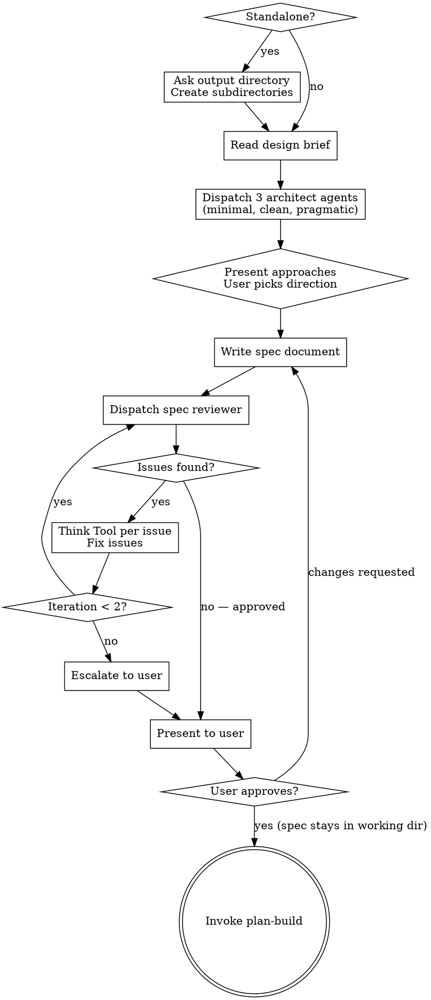

# Build Spec

Formalize an approved design into a durable spec document, validate it through automated and human review.

<HARD-GATE>
Do NOT invoke plan-build or any implementation skill until the spec has passed automated review AND the user has approved it. Only then proceed to invoke plan-build.
</HARD-GATE>

## Entry Condition

A design exists — either:
- A design brief from design-figure-out at `{CHESTER_WORKING_DIR}/{sprint-subdir}/design/{sprint-name}-design-00.md`
- A human-written brief or design from an external source
- A design described in conversation context

The working directory and subdirectories should already exist (created by figure-out). If invoked standalone, this skill creates them.

## Checklist

You MUST create a task for each of these items and complete them in order:

1. **Setup** — if invoked standalone (no figure-out), invoke `start-bootstrap`; otherwise sprint context already exists
2. **Read design brief** — read the design brief from disk or gather design from conversation context
3. **Competing architectures** — dispatch 3 `feature-dev:code-architect` agents with different trade-off lenses; present approaches to user; user picks direction
4. **Write spec document** — synthesize design into structured spec based on chosen architecture (see `util-artifact-schema` for output path and naming)
5. **Automated spec review loop** — dispatch spec-document-reviewer subagent with design brief, Think Tool gate per issue, fix and re-dispatch (max 2 iterations, then escalate to user)
6. **User review gate** — present clean spec to user for review; if changes requested, apply and loop back to step 5
7. **Transition** — invoke plan-build (spec is NOT committed here — `finish-archive-artifacts` copies all artifacts into the worktree for merge)

## Process Flow

**The terminal state is invoking plan-build.** Do NOT invoke any other implementation skill.

## Standalone Invocation

When invoked without a prior design-figure-out session, invoke `start-bootstrap` to
set up the sprint context (config, naming, directories, task reset).

## Competing Architectures

After reading the design brief but before writing the spec, dispatch three `feature-dev:code-architect` agents in parallel. Each receives the same design brief and codebase context but is constrained to a different trade-off profile:

| Agent | Lens | Prompt guidance |
|-------|------|-----------------|
| Architect 1 | **Minimal changes** | "Design an architecture for [design brief summary] that minimizes the diff. Maximize reuse of existing code, patterns, and infrastructure. Smallest possible change surface." |
| Architect 2 | **Clean architecture** | "Design an architecture for [design brief summary] that optimizes for maintainability and clarity. Use clean abstractions, clear boundaries, and future-proof the design — even if it means more upfront work." |
| Architect 3 | **Pragmatic balance** | "Design an architecture for [design brief summary] that balances implementation speed with code quality. Make pragmatic trade-offs — don't gold-plate, but don't cut corners that will hurt in 6 months." |

Each architect returns a complete blueprint with patterns found, architecture decision, component design, implementation map, data flow, and build sequence.

**Present the comparison to the user:**

1. Summarize each approach in 3–5 sentences — what it does differently and why
2. Compare trade-offs in a table: change surface, maintainability, implementation effort, risk
3. State your recommendation with reasoning — which approach best fits the design brief's goals and constraints
4. Ask the user which approach they prefer, or whether they want a hybrid

The user's choice (or hybrid direction) becomes the architectural foundation for the spec. If the user says "whatever you think," go with your recommendation but state it explicitly so the choice is on record.

This step exists because humans evaluate *comparisons* far better than *single proposals*. Presenting one architecture and asking "is this good?" is a weaker gate than presenting three and asking "which trade-off profile fits?"

## Writing the Spec

- Read the design brief from disk (if it exists) and conversation context
- Using the user's chosen architecture as the structural foundation, synthesize into a structured spec document covering: architecture, components, data flow, error handling, testing strategy, constraints, non-goals
- Scale each section to its complexity — a few sentences if straightforward, detailed if nuanced
- No YAML frontmatter is needed in spec documents. All skills read output paths from the project config, not from document frontmatter.
- Write to the `spec/` subdirectory (see `util-artifact-schema` for exact path and naming)

## Automated Spec Review Loop

**Review purpose: Design Alignment** — does the spec faithfully address the design brief's goals, constraints, and decisions?

After writing the spec:

1. Dispatch spec-document-reviewer subagent (see spec-reviewer.md in this skill directory)
   - Provide both the spec path AND the design brief path
   - If no design brief exists (standalone invocation), dispatch with spec only — the reviewer falls back to internal-consistency checking
2. The reviewer checks: goals coverage, constraints respected, no untraceable additions, internal consistency

**think gate (per issue):** When the spec reviewer returns issues, ask this question, think
about the results, and implement the findings:
  "Is this issue valid given the spec's stated intent? What is the minimal fix?
   Does this fix affect any adjacent section of the spec?"

Apply the fix, then move to the next issue. Re-dispatch the reviewer after all issues from the current round are addressed.

3. If loop exceeds 2 iterations, escalate to user for guidance
4. On subsequent iterations, increment the version number (see `util-artifact-schema` for versioning)

## User Review Gate

After the automated review loop passes:

> "Spec written and reviewed at `{path}`. Please review and let me know if you want changes before we proceed to the implementation plan."

Wait for the user's response. If they request changes, apply them and re-run the automated review loop. Only proceed once the user approves.

## Post-Approval

After the user approves the spec, it remains in the working directory. The spec is NOT committed here — `finish-archive-artifacts` copies all artifacts into the worktree for merge.

## MCP Usage

- **Think** only — per issue evaluation during the review loop
- Sequential and Structured thinking are not used; spec writing is craft, and the review loop volume does not warrant structured cross-referencing

## Integration

- **Calls:** `start-bootstrap` (standalone only)
- **Reads:** `util-artifact-schema` (naming/paths), `util-budget-guard`
- **Invoked by:** design-figure-out (primary), or user directly (standalone)
- **Transitions to:** plan-build
- **Does NOT invoke:** plan-attack, plan-smell, or any implementation skill
