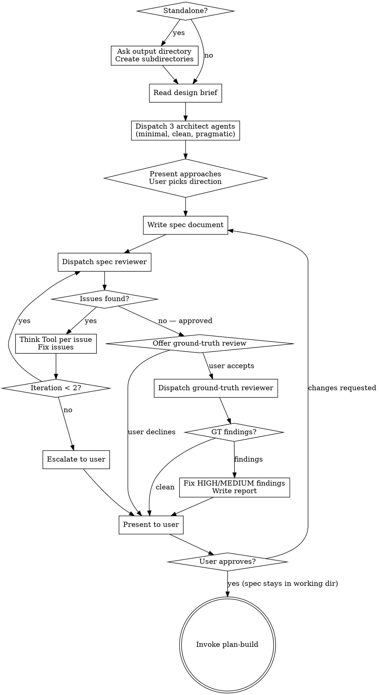

# Build Spec

Formalize an approved design into a durable spec document, validate it through automated and human review.

<HARD-GATE>
Do NOT invoke plan-build or any implementation skill until the spec has passed automated review AND the user has approved it. Only then proceed to invoke plan-build.
</HARD-GATE>

## Entry Condition

A design exists — either:
- A design brief from design-figure-out at `{CHESTER_WORKING_DIR}/{sprint-subdir}/design/{sprint-name}-design-00.md`
- A human-written brief or design from an external source
- A design described in conversation context

The working directory and subdirectories should already exist (created by figure-out). If invoked standalone, this skill creates them.

## Checklist

You MUST create a task for each of these items and complete them in order:

1. **Setup** — if invoked standalone (no figure-out), invoke `start-bootstrap`; otherwise sprint context already exists
2. **Read design brief** — read the design brief from disk or gather design from conversation context
3. **Competing architectures + prior art** — dispatch 4 agents in parallel: 3 `feature-dev:code-architect` agents with different trade-off lenses + 1 prior art explorer; present approaches to user with prior art context; user picks direction
4. **Write spec document** — synthesize design into structured spec based on chosen architecture (see `util-artifact-schema` for output path and naming)
5. **Automated spec review loop** — dispatch spec-document-reviewer subagent with design brief, Think Tool gate per issue, fix and re-dispatch (max 2 iterations, then escalate to user)
6. **Ground-truth review (opt-in)** — after fidelity review passes, offer codebase verification; if accepted, dispatch ground-truth-reviewer subagent, fix HIGH/MEDIUM findings, write report to `spec/` subdirectory
7. **User review gate** — present clean spec (and ground-truth report if generated) to user for review; if changes requested, apply and loop back to step 5
8. **Transition** — invoke plan-build (spec is NOT committed here — `finish-archive-artifacts` copies all artifacts into the worktree for merge)

## Process Flow

**The terminal state is invoking plan-build.** Do NOT invoke any other implementation skill.

## Standalone Invocation

When invoked without a prior design-figure-out session, invoke `start-bootstrap` to
set up the sprint context (config, naming, directories, task reset).

## Competing Architectures + Prior Art

After reading the design brief but before writing the spec, dispatch four agents in parallel. Three are architects proposing competing structural approaches; one researches prior art from adjacent sprints.

### Architect Agents

Dispatch three `feature-dev:code-architect` agents. Each receives the same design brief and codebase context but is constrained to a different trade-off profile:

| Agent | Lens | Prompt guidance |
|-------|------|-----------------|
| Architect 1 | **Minimal changes** | "Design an architecture for [design brief summary] that minimizes the diff. Maximize reuse of existing code, patterns, and infrastructure. Smallest possible change surface." |
| Architect 2 | **Clean architecture** | "Design an architecture for [design brief summary] that optimizes for maintainability and clarity. Use clean abstractions, clear boundaries, and future-proof the design — even if it means more upfront work." |
| Architect 3 | **Pragmatic balance** | "Design an architecture for [design brief summary] that balances implementation speed with code quality. Make pragmatic trade-offs — don't gold-plate, but don't cut corners that will hurt in 6 months." |

Each architect returns a complete blueprint with patterns found, architecture decision, component design, implementation map, data flow, and build sequence.

### Prior Art Explorer

Dispatch one `Explore` agent in parallel with the architects. This agent searches both the plans directory (archived, tracked) and the working directory (in-progress, gitignored) for design briefs, specs, plans, and thinking summaries from prior sprints relevant to the current design brief.

| Agent | Focus | Prompt guidance |
|-------|-------|-----------------|
| Explorer 4 | **Prior art & companion work** | "Search `{CHESTER_PLANS_DIR}/` and `{CHESTER_WORKING_DIR}/` for design briefs (`*-design-*.md`), specs (`*-spec-*.md`), plans (`*-plan-*.md`), and thinking summaries (`*-thinking-*.md`) from previous sprints. For each artifact found that is relevant to [design brief summary]: read it and extract (1) key findings and discoveries, (2) decisions made that constrain or inform the current design, (3) current status (Approved, Paused, Draft, Superseded), (4) any infrastructure or system that was found to be non-functional, partial, or blocked, (5) any code, types, or patterns that were built by prior sprints and could be reused or must be respected. Report organized by sprint, with brief name, status, and a summary of findings relevant to the current design." |

The prior art explorer's findings serve two purposes:
- **Context for the comparison** — when presenting the three architectures to the user, prior art findings may favor one approach over another (e.g., a prior sprint built infrastructure that Architect 1's minimal approach can reuse, or a paused sprint found that a pattern Architect 2 proposes doesn't work)
- **Constraint for the spec** — decisions, conventions, and non-functional infrastructure from companion work become constraints in the spec, preventing the spec from planning work against broken plumbing or contradicting adjacent design decisions

### After all four agents complete

**Present the comparison to the user:**

1. Summarize each architect's approach in 3–5 sentences — what it does differently and why
2. If the prior art explorer found relevant companion work, note how it affects each approach (e.g., "Architect 1's approach aligns with types built in sprint X" or "Architect 2's approach depends on validation wiring that sprint Y found non-functional")
3. Compare trade-offs in a table: change surface, maintainability, implementation effort, risk
4. State your recommendation with reasoning — which approach best fits the design brief's goals, constraints, and prior art context
5. Ask the user which approach they prefer, or whether they want a hybrid

The user's choice (or hybrid direction) becomes the architectural foundation for the spec. If the user says "whatever you think," go with your recommendation but state it explicitly so the choice is on record.

This step exists because humans evaluate *comparisons* far better than *single proposals*. Presenting one architecture and asking "is this good?" is a weaker gate than presenting three and asking "which trade-off profile fits?" The prior art explorer ensures all three proposals are grounded in what adjacent work has actually established, not just what the codebase looks like today.

## Writing the Spec

- Read the design brief from disk (if it exists) and conversation context
- Using the user's chosen architecture as the structural foundation, synthesize into a structured spec document covering: architecture, components, data flow, error handling, testing strategy, constraints, non-goals
- Scale each section to its complexity — a few sentences if straightforward, detailed if nuanced
- No YAML frontmatter is needed in spec documents. All skills read output paths from the project config, not from document frontmatter.
- Write to the `spec/` subdirectory (see `util-artifact-schema` for exact path and naming)

## Automated Spec Review Loop

**Review purpose: Design Alignment** — does the spec faithfully address the design brief's goals, constraints, and decisions?

After writing the spec:

1. Dispatch spec-document-reviewer subagent (see spec-reviewer.md in this skill directory)
   - Provide both the spec path AND the design brief path
   - If no design brief exists (standalone invocation), dispatch with spec only — the reviewer falls back to internal-consistency checking
2. The reviewer checks: goals coverage, constraints respected, no untraceable additions, internal consistency

**think gate (per issue):** When the spec reviewer returns issues, ask this question, think
about the results, and implement the findings:
  "Is this issue valid given the spec's stated intent? What is the minimal fix?
   Does this fix affect any adjacent section of the spec?"

Apply the fix, then move to the next issue. Re-dispatch the reviewer after all issues from the current round are addressed.

3. If loop exceeds 2 iterations, escalate to user for guidance
4. On subsequent iterations, increment the version number (see `util-artifact-schema` for versioning)

## Ground-Truth Review (Opt-In)

After the spec fidelity review passes, offer the ground-truth review:

> "Spec fidelity review passed. Would you like to run a ground-truth review to verify
> spec claims against the actual codebase? This is recommended for specs that reference
> existing types, APIs, file paths, or runtime behavior. Skip for greenfield specs with
> no existing code references."

If the user declines, proceed directly to the user review gate.

If the user requests changes at the user review gate and the flow loops back through the fidelity review, do not re-offer the ground-truth review if it already ran in this session — proceed directly to the user review gate unless the user's changes materially alter code references.

If the user accepts:

1. Dispatch ground-truth-reviewer subagent (see ground-truth-reviewer.md in this skill directory)
   - Provide: spec path AND design brief path
   - The subagent reads source files to verify every claim the spec makes about existing code
2. On return, evaluate findings by severity:
   - **HIGH findings:** Fix the spec (increment version per `util-artifact-schema`). Re-run the ground-truth review only — do not re-run the fidelity review, since the fix targets codebase accuracy, not brief alignment. Exception: if the fix changes the spec's architectural approach (not just correcting a reference), re-run the fidelity review as well.
   - **MEDIUM findings:** Fix the spec. No re-review needed unless the fix is substantial.
   - **LOW findings:** Note in the report. Do not fix the spec — these are context for the implementer.
   - **Iteration cap:** If the ground-truth review loop exceeds 2 iterations, escalate to user for guidance — matching the fidelity review pattern.
3. Write the ground-truth report to the `spec/` subdirectory as `{sprint-name}-spec-ground-truth-report-00.md` (see `util-artifact-schema`)
4. Present the report summary to the user alongside the spec at the user review gate

The ground-truth report is preserved as an artifact. In a future iteration, `plan-build`
could pass the ground-truth report to plan-attack to reduce redundant verification at the
plan stage — but that is out of scope for this change.

## User Review Gate

After the automated review loop passes:

> "Spec written and reviewed at `{path}`. Please review and let me know if you want changes before we proceed to the implementation plan."

If a ground-truth review was performed, also present:

> "Ground-truth review report at `{report-path}`. [N] findings ([breakdown by severity]). [1-sentence risk summary from report]."

Wait for the user's response. If they request changes, apply them and re-run the automated review loop. Only proceed once the user approves.

## Post-Approval

After the user approves the spec, it remains in the working directory. The spec is NOT committed here — `finish-archive-artifacts` copies all artifacts into the worktree for merge.

## MCP Usage

- **Think** only — per issue evaluation during the review loop
- Sequential and Structured thinking are not used; spec writing is craft, and the review loop volume does not warrant structured cross-referencing

## Integration

- **Calls:** `start-bootstrap` (standalone only)
- **Dispatches:** ground-truth-reviewer subagent (opt-in, after fidelity review)
- **Reads:** `util-artifact-schema` (naming/paths), `util-design-brief-template` (brief structure reference), `util-budget-guard`
- **Invoked by:** design-figure-out (primary), or user directly (standalone)
- **Transitions to:** plan-build
- **Does NOT invoke:** plan-attack, plan-smell, or any implementation skill
