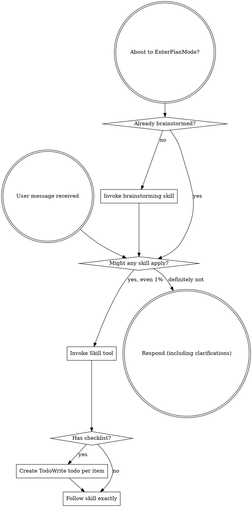

<SUBAGENT-STOP>
If you were dispatched as a subagent to execute a specific task, skip this skill.
</SUBAGENT-STOP>

<EXTREMELY-IMPORTANT>
If you think there is even a 1% chance a skill might apply to what you are doing, you ABSOLUTELY MUST invoke the skill.

IF A SKILL APPLIES TO YOUR TASK, YOU DO NOT HAVE A CHOICE. YOU MUST USE IT.

This is not negotiable. This is not optional. You cannot rationalize your way out of this.
</EXTREMELY-IMPORTANT>

## Instruction Priority

Chester skills override default system prompt behavior, but **user instructions always take precedence**:

1. **User's explicit instructions** (CLAUDE.md, direct requests) — highest priority
2. **Chester skills** — override default system behavior where they conflict
3. **Default system prompt** — lowest priority

If CLAUDE.md says "don't use TDD" and a skill says "always use TDD," follow the user's instructions. The user is in control.

## Session Housekeeping

At the start of every session:

1. **Verify jq availability:** Run `which jq`. If jq is not installed, warn: "Budget guard requires jq for JSON parsing. Install jq for token budget monitoring." Continue without the guard.

2. **First-run project configuration:** Check for project-scoped Chester config:
   ```bash
   eval "$(chester-config-read)"
   ```
   If `CHESTER_CONFIG_PATH` is `none`, this is a new project. Run the first-run setup:

   a. Announce: "This looks like a new project for Chester. Let's get your directories set up."

   b. Explain the two-directory model and ask for both paths:
   ```
   Chester uses two directories during development:

   1. **Working directory** — a gitignored scratch space where design briefs, specs,
      and plans live while you're actively working on them. This stays outside of
      worktrees so you always know where to find your documents during review.

   2. **Plans directory** — a tracked directory inside your repository where finished
      artifacts are committed alongside your code, creating a permanent record of the
      design and planning process.

   Working directory (gitignored): docs/chester/working/
   Plans directory (tracked in git): docs/chester/plans/

   Accept defaults? Or enter custom paths.
   ```

   c. User accepts defaults or provides custom paths (one or both).

   d. Create the working directory:
   ```bash
   mkdir -p "$CHESTER_WORKING_DIR"
   ```

   e. Ensure the working directory is in `.gitignore`:
   ```bash
   # Use the relative path for .gitignore (not the absolute resolved path)
   WORKING_DIR_RELATIVE="<user's chosen working directory>"
   if ! git check-ignore -q "$WORKING_DIR_RELATIVE" 2>/dev/null; then
     echo "$WORKING_DIR_RELATIVE/" >> .gitignore
     git add .gitignore
     git commit -m "chore: add chester working directory to .gitignore"
   fi
   ```

   f. Ensure the plans directory is NOT in `.gitignore` (it must be tracked):
   ```bash
   if git check-ignore -q "$CHESTER_PLANS_DIR" 2>/dev/null; then
     # Remove the gitignore entry — plans directory must be tracked
     sed -i "\|^$CHESTER_PLANS_DIR|d" .gitignore
     git add .gitignore
     git commit -m "chore: unignore chester plans directory (tracked for history)"
   fi
   ```

   g. Write project config:
   ```bash
   PROJECT_ROOT="$(git rev-parse --show-toplevel 2>/dev/null || pwd)"
   mkdir -p "$PROJECT_ROOT/.claude"
   ```
   Write to `$PROJECT_ROOT/.claude/settings.chester.local.json`:
   ```json
   {
     "working_dir": "<user's chosen working directory>",
     "plans_dir": "<user's chosen plans directory>"
   }
   ```
   Create user-level config if it doesn't exist:
   ```bash
   if [ ! -f "$HOME/.claude/settings.chester.json" ]; then
     echo '{}' > "$HOME/.claude/settings.chester.json"
   fi
   ```

   h. Announce — use exactly this format:
   ```
   Chester is configured.
   - Working directory: {CHESTER_WORKING_DIR} (gitignored)
   - Plans directory: {CHESTER_PLANS_DIR} (tracked)
   ```

   If `CHESTER_CONFIG_PATH` is not `none`, this is a returning session. Run these
   verification checks silently, fixing what you can and warning about what you can't:

   **Check 0: Config has both directory keys.**
   Read `settings.chester.local.json` and verify it contains both `working_dir` and
   `plans_dir`. If either key is missing, add it with the default value and rewrite
   the file. Warn: "Config was missing {key} — added default: {value}".

   **Check 1: Working directory exists on disk.**
   ```bash
   if [ ! -d "$CHESTER_WORKING_DIR" ]; then
     mkdir -p "$CHESTER_WORKING_DIR"
     # Warn: "Created missing working directory at {path}"
   fi
   ```

   **Check 2: Working directory IS gitignored** (it must not be tracked).
   ```bash
   WORKING_DIR_RELATIVE="<relative path from config>"
   if ! git check-ignore -q "$WORKING_DIR_RELATIVE" 2>/dev/null; then
     echo "$WORKING_DIR_RELATIVE/" >> .gitignore
     git add .gitignore
     git commit -m "chore: add chester working directory to .gitignore"
     # Warn: "Working directory was not gitignored — fixed."
   fi
   ```

   **Check 3: Plans directory is NOT gitignored** (it must be tracked).
   ```bash
   if git check-ignore -q "$CHESTER_PLANS_DIR" 2>/dev/null; then
     sed -i "\|^$CHESTER_PLANS_DIR|d" .gitignore
     git add .gitignore
     git commit -m "chore: unignore chester plans directory (tracked for history)"
     # Warn: "Plans directory was gitignored — fixed. Plans must be tracked."
   fi
   ```

   **After checks, always echo BOTH resolved paths to the user — exactly this format:**

   ```
   Chester is configured.
   - Working directory: {CHESTER_WORKING_DIR} (gitignored)
   - Plans directory: {CHESTER_PLANS_DIR} (tracked)
   ```

   Both lines are mandatory. Do not omit the working directory. Do not paraphrase
   or summarize into a single line. The user must see both paths so misconfigurations
   are caught immediately, not three skills later.

## How to Access Skills

**In Claude Code:** Use the `Skill` tool.

# Using Skills

## The Rule

**Invoke relevant or requested skills BEFORE any response or action.** Even a 1% chance a skill might apply means that you should invoke the skill to check. If an invoked skill turns out to be wrong for the situation, you don't need to use it.



## Red Flags

These thoughts mean STOP — you're rationalizing:

| Thought | Reality |
|---------|---------|
| "This is just a simple question" | Questions are tasks. Check for skills. |
| "I need more context first" | Skill check comes BEFORE clarifying questions. |
| "Let me explore the codebase first" | Skills tell you HOW to explore. Check first. |
| "I can check git/files quickly" | Files lack conversation context. Check for skills. |
| "Let me gather information first" | Skills tell you HOW to gather information. |
| "This doesn't need a formal skill" | If a skill exists, use it. |
| "I remember this skill" | Skills evolve. Read current version. |
| "This doesn't count as a task" | Action = task. Check for skills. |
| "The skill is overkill" | Simple things become complex. Use it. |
| "I'll just do this one thing first" | Check BEFORE doing anything. |
| "This feels productive" | Undisciplined action wastes time. Skills prevent this. |
| "I know what that means" | Knowing the concept ≠ using the skill. Invoke it. |

## Skill Priority

When multiple skills could apply, use this order:

1. **Gate skills first** (`design-figure-out`, `design-experimental`, `design-small-task`, `design-specify`, `plan-build`, `execute-write`, `execute-verify-complete`, `finish-close-worktree`) — these define the overall pipeline stage and determine HOW to approach the task
2. **Review skills second** (`plan-attack`, `plan-smell`, `util-codereview`) — these harden and validate the work
3. **Behavioral skills third** (`execute-test`, `execute-debug`, `execute-prove`, `execute-review`) — these guide specific execution disciplines
4. **Utility skills fourth** (`util-worktree`, `util-dispatch`) — these support workflow mechanics

"Let's build X" → `design-figure-out` first, then `design-specify`, then `plan-build`.
"Quick design check for X" → `design-small-task` first, then `plan-build`.
"Write a spec for this" → `design-specify` directly.
"Fix this bug" → `execute-debug` first, then domain-specific skills.

## Skill Types

**Rigid** (`execute-test`, `execute-debug`): Follow exactly. Don't adapt away discipline.

**Flexible** (patterns): Adapt principles to context.

The skill itself tells you which.

## Available Chester Skills

### Pipeline Skills (define the workflow stage)
- `setup-start` — Entry point; establishes the pipeline and skill usage rules (this skill)
- `start-bootstrap` — Mechanical session setup: config, sprint naming, dir creation, task reset, thinking history
- `design-figure-out` — Quantitatively-disciplined Socratic discovery with understanding MCP (Phase 1) and enforcement gating (Phase 2). Resolves open design questions before specification.
- `design-experimental` — Experimental two-phase design skill: Plan Mode understanding (Phase 1), formal proof-building with structural validation (Phase 2). Fork of design-figure-out for validating proof-based design discipline.
- `design-small-task` — Lightweight design conversation for well-bounded tasks. Surfaces considerations through structured Q&A, produces a brief for plan-build. No MCP, no spec step.
- `design-specify` — Formalize approved designs into spec documents with automated review
- `plan-build` — Write and harden implementation plans
- `execute-write` — Execute plans, request code review, and perform subagent-driven development
- `execute-verify-complete` — Capstone of execution: prove tests, clean tree, checkpoint commit

### Finish Skills (close out a sprint)
- `finish-write-records` — Session summary, reasoning audit, cache analysis (also handles refactor summaries)
- `finish-archive-artifacts` — Copy working dir artifacts to tracked plans dir and commit
- `finish-close-worktree` — Branch integration (merge/PR/keep/discard) and worktree cleanup

### Review Skills (harden and validate)
- `plan-attack` — Adversarial review of plans for structural gaps, execution risks, and assumptions
- `plan-smell` — Forward-looking code smell analysis of an implementation plan
- `util-codereview` — Lightweight code smell review of existing code scoped to a directory or path

### Behavioral Skills (execution disciplines)
- `execute-test` — Test-driven development discipline
- `execute-debug` — Systematic debugging workflow
- `execute-prove` — Verification before completion
- `execute-review` — Receiving and acting on code review feedback

### Utility Skills (workflow mechanics and reference)
- `util-worktree` — Git worktree workflow for parallel branches
- `util-dispatch` — Dispatching parallel subagents
- `util-budget-guard` — Token budget check procedure (read, don't invoke)
- `util-artifact-schema` — Artifact naming, versioning, and directory layout (read, don't invoke)
- `util-design-brief-template` — Design brief output structure and section requirements (read, don't invoke)
- `util-design-brief-small-template` — Lightweight design brief template for bounded tasks (6 sections vs 13). Read, don't invoke.

## User Instructions

Instructions say WHAT, not HOW. "Add X" or "Fix Y" doesn't mean skip workflows.
